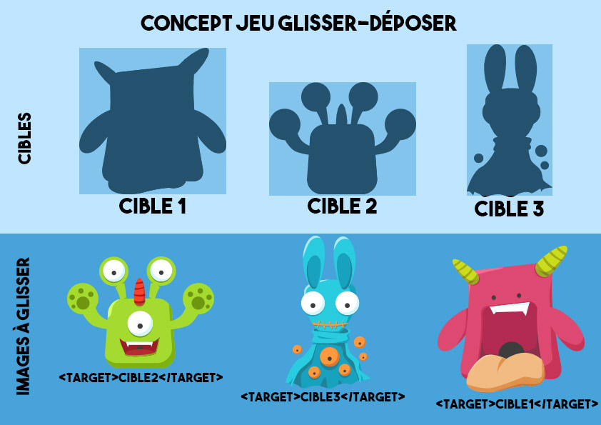
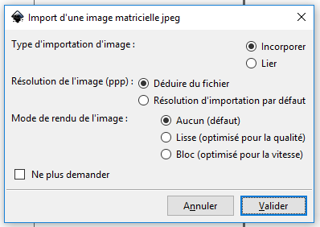
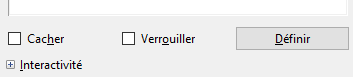

# Réaliser un mini jeu simple Glisser Déposer

*Concept* : définir des cibles et indiquer aux images déplaçables quelles sont leur cible. Indiquer un score à obtenir et un message de succès.

Exemples :
- [Jeu du Dino](http://xia.dane.ac-versailles.fr/demo/dino/index.html)
- [Jeu des articulations](http://xia.dane.ac-versailles.fr/demo/articulations/index.html)

## C'est parti !

Pour réaliser cet atelier, veuillez télécharger le dossier suivant : [Monstres](docs/monstres.zip)

### Préparation des images

En amont de la création du jeu, il faut travailler les visuels.   
- Quelle va-t-être l'image de fond ? Est-ce qu'il y aura les cibles dessinées dessus ou pas ?
- Quelles vont-être les images à déplacer ?

Pour cet atelier, nous avons choisi de dessiner les cibles (les formes des monstres) sur l'image de fond. Et de prendre 4 monstres comme image déplaçables. 

Une fois que vous possédez tout le matériel nécessaire pour créer le jeu, vous pouvez vous attaquer à sa création.

### Étape 1 - Charger les images

Ouvrez **Inkscape**.  
  
Chargez l'image de fond : **Fichier -> Ouvrir -> monstres.jpg**  
Chargez les images déplaçables : **Fichier -> Importer -> monstre1.png, monstre2.png, monstre3.png, monstre4.png**

À chaque fois, validez l'importation de l'image.   

### Étape 2 - Définir les cibles

1- Dessiner des rectangles à l'endroit des cibles. Leur largeur et hauteur doivent correspondre à celles des silhouettes des monstres.   
2- **Clic droit sur chaque rectangle -> Propriété de l'objet -> Champ ID** : copier l'ID "rectXXX" ou modifiez-le "monstre1", "monstre2" etc. Cliquez sur le bouton **Définir**.  
  
3- Indiquez à l'image déplaçable correspondante quelle est sa cible. Pour cela, **clic droit sur l'image -> Propriété de l'objet -> Description.** Dans le champ Description, écrivez le code:   
**&lt;target&gt;ID de la cible&lt;/target&gt;**. Vous remplacez alors ID de la cible par "rectXXX" ou "monstre1". Cliquez sur le bouton **Définir**.

Répétez l'opération pour les 4 monstres.

*Conseil* : Automatisez le traitement en modifiant tous les ID des cibles d'un coup : monstre1, monstre2 etc. Copier-coller ensuite le code **&lt;target&gt;ID de la cible&lt;/target&gt;** à la chaîne dans toutes vos images déplaçables en changeant l'ID à chaque fois.

### Étape 3 - Paramétrer des comportements spécifiques de cibles ou d'images déplaçables

Le paramétrage se fait dans le champ Description des objets concernés. Pensez toujours à Définir à chaque modification.

Définir le retour des monstres à leur position d'origine s'ils ne sont pas placés au bon endroit : **&lt;onfail&gt;return&lt;/onfail&gt;** (champ Description de l'image déplaçable)   

### Étape 4 - Paramétrer le jeu

Le paramétrage du jeu se fait sur l'image de fond.   
**Clic droit sur l'image de fond -> Propriété de l'objet -> champ Description.**   
Après chaque modification du champ Description, pensez à cliquer sur le bouton **Définir**.

Définir le score : **&lt;score&gt;"nombre de bonnes réponses attendues"&lt;/score&gt;** Exemple ici: **&lt;score&gt;4&lt;/score&gt;**  
Définir le message de réussite : **&lt;message&gt;Super tu as réussi !&lt;/message&gt;**  
Magnétiser toutes les cibles : **&lt;magnet&gt;on&lt;/magnet&gt;**   

### Étape 5 - Écrire la consigne

**Fichier -> Propriétés du document -> Métadonnées.**   
Remplissez les champs que vous souhaitez notamment le titre.
Remplir le champ **description** avec la consigne. Elle apparaîtra à l'ouverture de l'image Xia.  
Exemple ici : "Associe chaque monstre à sa silhouette."  

### Étape 6 - Exporter le jeu

**Extension -> Exporter -> XiaEdu**
Choisir l'export DragAndDrop.  
  
Vous pouvez ensuite tester votre image en allant ouvrir le fichier .html généré. 
