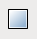
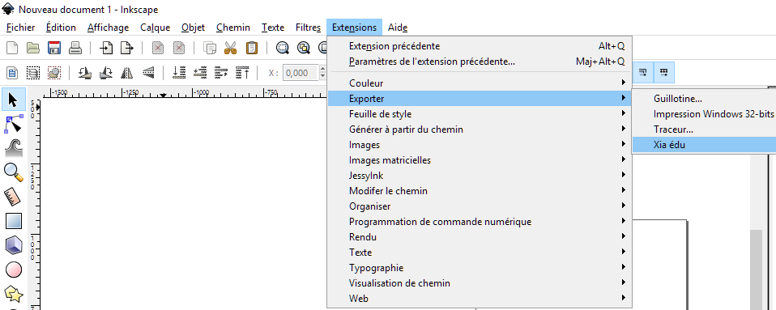
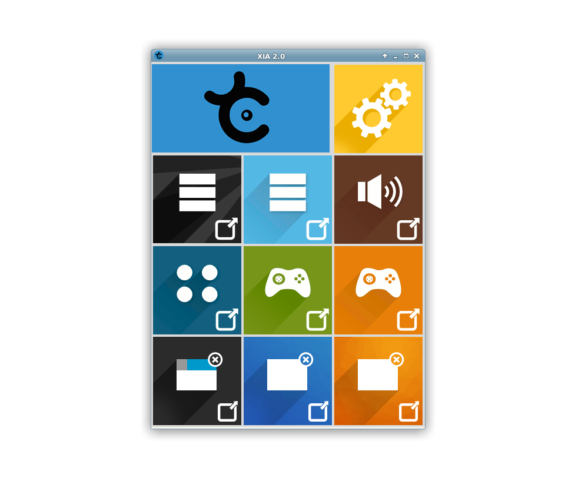
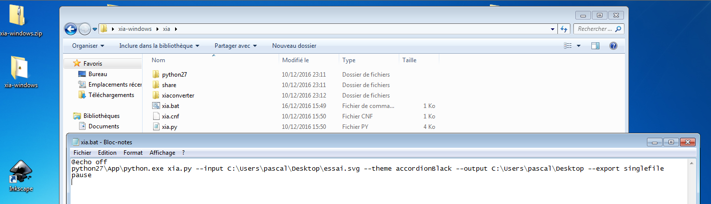
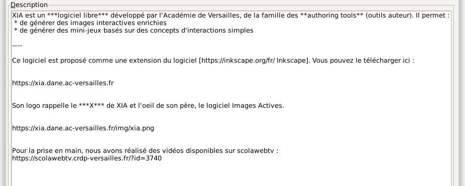
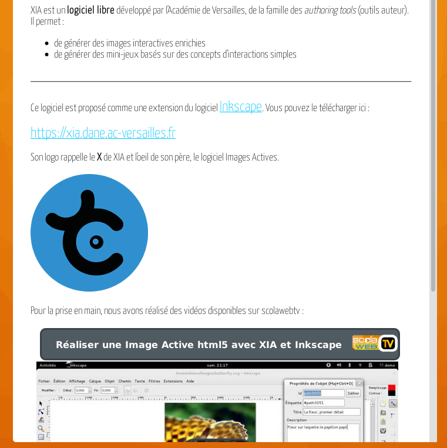
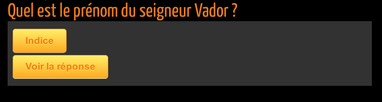
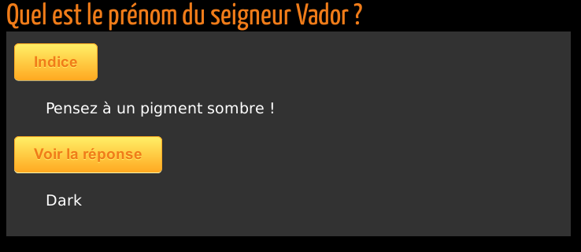
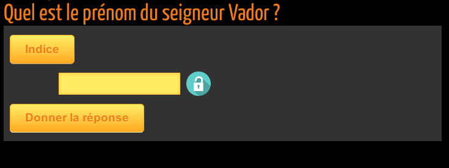
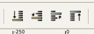

# Xia
### Créer des images interactives au format HTML5


## Sommaire

- [1. Présentation de Xia](#presentation)
 - [1.1. Qu'est-ce que Xia ?](#quest-ce-que-xia)
 - [1.2. Processus général ?](#processus-general)
 - [1.3. Installer Inkscape et Xia ?](#installer-inkscape-et-xia)
- [2. Création d'une première image interactive avec Inkscape et Xia](#creation-dune-premiere-image-interactive)
 - [2.1. Création de la ressource support](#creation-ressource-support)
 - [2.2. Génération de l'image interactive avec Xia](#generation-image-interactive)
 - [2.3. Usage d'expert !](#export-ligne-de-commande)
- [3. Images interactives enrichies](#images-interactives-enrichies)
 - [3.1. Mise en forme du texte (moteur wiki)](#mise-en-forme-du-texte)
 - [3.2. Insérer des ressources multimédias dans les commentaires](#inserer-ressources-multimedia)
  - [3.2.1. Utiliser une ressource locale](#ressource-multimedia-locale)
  - [3.2.2. Utiliser une intégration iframe](#ressource-multimedia-iframe)
  - [3.2.3. Utiliser une intégration oembed](#ressource-multimedia-oembed)
 - [3.3. Insérer des images dans votre image interactive](#inserer-des-images)
  - [3.3.1. Image de fond composite](#image-de-fond-composite)
  - [3.3.2. Image sélectionnable](#image-selectionnable)
 - [3.4. Faire apparaître une question/un indice et dévoiler une réponse](#question-reponse)
 - [3.5. Contrôler le comportement des détails: affichage immédiat et désactivation](#comportement-details)
 - [3.6. Contrôler l'ordre d'affichage des détails dans la barre latérale des commentaires](#ordre-details)
 - [3.7. En résumé](#resume-images-enrichies)
- [4. Créer des jeux avec Xia](#creer-des-jeux)
 - [4.1. Premier principe ludique: sélectionner, trouver des éléments dans une image](#game-one-clic)
 - [4.2. Second principe ludique: classer, organiser, hiérarchiser](#game-drag-and-drop)
 - [4.3. Options et astuces](#jeux-options-et-astuces)
  - [4.3.1. Astuce : Montrer la progression dans le jeu (thème game1clic)](#jeux-astuce-progression)
  - [4.3.2. Option : Montrer les erreurs du joueur (thème game1clic)](#jeux-options-score2)
  - [4.3.3. Option : Comment ajouter un effet «aimant» (thème gameDragAndDrop)](#jeux-options-magnet)
  - [4.3.4. Option : Infobulles (thèmes game1clic et gameDragAndDrop)](#jeux-options-infobulles)
  - [4.3.5. Gestion des feedbacks](#gestion-feedbacks)
  - [4.4. En résumé](#jeux-resume)
- [5. Foire aux questions](#faq)
- [6. Astuces Inkscape](#astuces)

## 1. Présentation de Xia <a name="presentation"></a>

### 1.1. Qu'est-ce que Xia? <a name="quest-ce-que-xia"></a>

Xia est un logiciel libre développé par des enseignants de l'académie de Versailles. Il est distribué sous la licence [GPLv3](http://www.gnu.org/copyleft/gpl.html). Le logiciel xia a pour fonction de transformer un fichier svg en une animation interactive html5. Xia permet de générer des jeux et activités interactives: jeux de glisser-déposer, sélection, discrimination, etc.

Les premières parties de cette documentation (voir la partie [II](#first_image)) sont consacrées à la réalisation d'une image interactive simple: détails détourés et commentaires en texte sans mise en forme. Par la suite, vous apprendrez à créer des images interactives enrichies (voir la partie [III](#enriched_IA)). Dans les dernières parties (partie \ref{games_IA}), vous découvrirez comment créer des jeux.


Tous les exemples utilisés sont visibles en ligne (les liens pour visualiser les animations et télécharger les fichiers sources sont indiqués en début de chaque section). À la fin de chaque partie, une rubrique «~En résumé~» rappelle les points essentiels à retenir pour créer une image interactive.


### 1.2. Processus général <a name="processus-general"></a>

Xia n'est nécessaire qu'à la fin du processus. Comme on peut le voir sur l'illustration ci-dessous, la plus grande partie du travail est réalisée avec un logiciel de dessin vectoriel. Nous recommandons l'utilisation du logiciel libre et multi-plateforme [Inkscape](http://www.inkscape.org/), très simple à utiliser (c'est ce logiciel qui sera utilisé dans ce tutoriel).


Si vous possédez des projets créés avec le logiciel ImagesActives (fichiers possédant une extension .xia), vous pouvez changer l'extension de ces fichiers en .zip, les dézipper, récupérer le fichier svg se trouvant dans le répertoire ainsi obtenu et ouvrir celui-ci avec Inkscape. Si vous utilisez GNU/Linux, explorez le fichier «.xia» et récupérez le fichier «.svg».


### 1.3. Installer Inkscape et Xia <a name="installer-inkscape-et-xia"></a>

L'installation d'Inkscape et de Xia sont les seuls prérequis pour la poursuite de la lecture de cette documentation. Vous trouverez les informations nécessaires à l'installation d'Inkscape sur le site web du projet https://inkscape.org/fr/telecharger/.

Installez impérativement Inkscape en premier, puis Xia, sous peine de ne pas être en mesure d'accéder à Xia directement dans Inkscape.

## 2. Création d'une première image interactive avec Inkscape et Xia <a name='creation-dune-premiere-image-interactive'></a>

### 2.1. Création de la ressource support <a name='creation-ressource-support'></a>


Visualisez l' [image interactive](https://xia.dane.ac-versailles.fr/demo/tuto/xia1) créée pour cette partie de la documentation. Téléchargez le fichier source au format
[svg](https://xia.dane.ac-versailles.fr/demo/tuto/xia1/svg/xia1.svg).


Les manipulations décrites dans cette partie de la documentation vous permettront de créer une image interactive «basique», comprenant:
- Détails zoomables
- Commentaires uniquement constitués de texte non mis en forme

Une fois l'image choisie, ouvrez-la dans Inkscape -> Fichier -> Ouvrir  

Quand Inkscape vous demande de choisir **Lier** et **Incorporer l'image**, choisissez **Incorporer**.

Les informations renseignées dans les **Métadonnées du document** (menu **Fichier**) seront conservées dans l'animation générée : titre, créateur, droits, etc. Il est donc fortement conseillé de renseigner ces informations. Le rendu est visible sur l'image ci-dessous :


Le titre renseigné dans les métadonnées du document apparait au-dessus de l'image interactive et donnent son nom à la page web l'affichant. Le créateur et les droits associés apparaissent dans la pop up accessible via l'icône «**i**» située à droite du titre de l'image interactive.

Vous pouvez sauvegarder votre projet au format svg dès le début du travail, en allant dans le menu -> Fichier -> Enregistrer.

Vous pouvez, par souci de clarté, supprimer l'extension d'origine de votre image dans le champ **Nom** de la fenêtre de dialogue. Enfin, dans le menu déroulant, choisissez le format de fichier Inkscape svg:

**SVG Inkscape (*.svg)**

De nombreux outils d'Inkscape peuvent être utilisés pour détourer les détails qui deviendront actifs dans l'animation générée par Xia. Parmi ceux-ci:
-  Créer des rectangles et des carrés
-  Créer des cercles, des ellipses et des arcs
-  Dessiner des lignes à main levée
-  Tracer des courbes de Bézier et des segments de droite

Sans rentrer dans le détail du fonctionnement de ces différents outils (Pour cela, lire le [manuel d'inkscape](http://inkscape.org/doc/shapes/tutorial-shapes.fr.html) ou le [manuel Floss](http://en.flossmanuals.net/inkscape/)), sachez que l'outil **Tracer des courbes de Bézier et des segments de droite** permet de détourer "clic par clic" (les points de construction du polygone sont alors appelés des «**nœuds**»). Vous pouvez refermer votre polygone en cliquant sur le premier nœud de ce même polygone. Vous pouvez dessiner des **Courbes de Bézier** en gardant le clic de votre souris enfoncé après avoir créé un nœud, puis en déplaçant le curseur pour faire apparaître les poignées de contrôle afin de modifier la forme de la courbe.


Si vous laissez une forme ouverte dans Inkscape (une courbe par exemple), Xia refermera automatiquement celle-ci en joignant son point de départ et d'arrivée.


L'ordre de création des détails dans Inkscape sera respecté dans l'image interactive au format html5 (par exemple, le premier détail détouré dans Inkscape apparaîtra en haut dans le modèle accordéon ou en numéro 1 dans le modèle boutons).

Une fois les détails détourés (La couleur du contour des détails dans l'animation générée par Xia sera la même que celle choisie dans Inkscape), vous pouvez les sélectionner avec l'outil **Sélectionner et transformer des objets** afin de les redimensionner, les déplacer, etc.


Si vous avez des difficultés pour sélectionner un détail que vous avez détouré, appliquez-lui une couleur de fond. N'importe quelle couleur fera l'affaire, sauf noir et blanc (pour comprendre pourquoi, lisez la rubrique \ref{white_black_background}).


Vous pouvez accéder aux **Propriétés de l'objet** par un clic-droit sur le détail détouré. À partir de là, vous accédez à une fenêtre de dialogue vous permettant d'ajouter le texte qui sera associé au détail dans l'image interactive:


Les deux champs devant nécessairement être renseignés dans cette fenêtre sont les champs **Titre** et **Description**. Le titre deviendra celui du détail, la description son commentaire. N'oubliez pas de cliquer sur le bouton **Définir** avant de fermer la fenêtre des **Propriétés de l'objet**.

Le processus décrit ci-dessus doit également être effectué avec l'image de fond: le titre et la description de celle-ci serviront d'introduction générale à l'image interactive (il s'agit d'un titre et d'un commentaire qui ne sont pas reliés à un détail particulier).

### 2.2. Génération de l'image interactive avec Xia <a name='generation-image-interactive'></a>

Quand tous les détails sont détourés et leurs métadonnées renseignées, Xia peut être lancé en cliquant sur `> Extensions > Exporter > Xia édu`.



Choisissez un modèle d'export et un répertoire d'enregistrement de l'image interactive.

En cliquant sur l'une des icônes des modèles d'export, vous générez un fichier `html`. Double-cliquez dessus pour l'ouvrir dans votre navigateur pour voir votre image interactive au format html5.


La ressource ainsi générée nécessite un accès internet pour fonctionner pleinement.




## 2.3. Usage d'expert ! <a name='export-ligne-de-commande'></a>

Vous pouvez générer vos animations html5 en utilisant le `terminal` avec la commande **xia**. Les paramètres à utiliser sont **--input** pour indiquer le fichier en entrée, **--output** pour indiquer le répertoire d'export, **--theme** pour indiquer le thème choisi.


**Avec GNU/Linux**, pour un export fichier unique utilisant le thème accordionBlack :
```
xia --input monfichier.svg --output ~/export --theme accordionBlack --export singlefile --quality 3
```

**Avec Mac OS X**, pour un export utilisable sans connexion internet, utilisant le thème gameDragAndDrop :

```
cd /Applications/xia.app/Contents/Resources/
python xia.py --input monfichier.svg --output ~/export --theme gameDragAndDrop
```

**Avec Windows**, pour un export fichier unique utilisant le thème accordionBlack, il faut utiliser l'outil XIA version portable (téléchargeable sur le site de XIA). Une fois l'archive zip décompressée,(supposons que vous l'ayez fait dans xia-windows), il faut éditer le fichier `xia-windows/xia/xia.bat` comme suit :




Puis double-cliquer sur le fichier `xia.bat` pour lancer l'export.


<a name='enriched_ia'></a>

## 3. Images interactives enrichies <a name='images-interactives-enrichies'></a>


Visualisez l'[image interactive](https://xia.dane.ac-versailles.fr/demo/tuto/xia2) créée pour cette partie de la documentation. Téléchargez le fichier source au format [svg](https://xia.dane.ac-versailles.fr/demo/tuto/xia2/svg/xia2.svg).

Dans cette section, l'objectif demeure la création d'une image interactive «**simple**» (autrement dit, dans laquelle un détail fait apparaître un commentaire). Cependant, le texte des commentaires sera enrichi par une mise en forme ou des ressources multimédias.


### 3.1. Mise en forme du texte (moteur Wiki) <a name='mise-en-forme-du-texte'></a>

Pour enrichir le texte et proposer des ressources multimédia, XIA s'appuie sur une syntaxe wiki élémentaire. Comme vous pouvez le constater en comparant les deux captures ci-dessous, il suffit d'ajouter des **marqueurs** spécifiques dans le texte pour réaliser la mise en forme ou simplement écrire les liens vers les ressources à intégrer.


Texte saisi avec les marqueurs wiki :



Rendu final :



#### Syntaxe Wiki et intégration de ressources.

- `***Mettre en gras***`
- `**Mettre en italique**`
- `{{{écrire du texte sans formatage}}}`
- Pour insérer une image qui se trouve sur internet, écrivez simplement le lien vers cette image :
```
https://xia.dane.ac-versailles.fr/img/xia.png
```
- Pour insérer une image qui se trouve à côté de la ressource XIA que vous avez générée, utilisez la syntaxe des chemins relatifs :
```
./mon_image.jpeg
../images/mon_autre_image.jpeg
```

- Pour créer un hyperlien vers le site XIA, saisissez simplement l'url :
```
https://xia.dane.ac-versailles.fr
```
- Pour créer un hyperlien sur un mot ou une expression :
```
[https://xia.dane.ac-versailles.fr SITE XIA]
```
- Pour créer un hyperlien sur une adresse mail, saisissez simplement l'adresse mail :
```
dev-xia@ac-versailles.fr
```

- Utiliser une liste à puces (***Placer un espace devant chaque astérisque***) :
```
 * élément 1
 * élément 2
   * élément 2-1
   * élément 2-2
```

### 3.2. Insérer des ressources multimédias dans les commentaires <a name='inserer-ressources-multimedia'></a>

#### 3.2.1. Utiliser une ressource locale <a name='ressource-multimedia-locale'></a>

L'insertion de ressources multimédias dans les commentaires est chose assez aisée: copiez-collez l'url de la ressource (qu'elle soit absolue ou relative) ou le code iframe du service web utilisé pour héberger votre ressource, et Xia créera automatiquement un lecteur multimédia, pour peu que celle-ci (image, son, vidéo) fasse partie des formats supportés :

- **[Images]** : jpg, jpeg, png, gif
- **[Audio]** : ogg, mp3
- **[Video]** : ogv, webm, mp4

Le lien doit être inséré dans le champ `Description` des `Propriétés de l'objet`.

- **[Lien absolu]** : Si l'url de la ressource est `http://web.crdp.ac-versailles.fr/02546.ogg`, il suffit alors d'écrire cette url dans le champ `Description` des
`Propriétés de l'objet` dans Inkscape.

- **[Lien relatif]** : Si le fichier de la ressource multimédia se trouve dans le répertoire d'export de l'image interactive, ou dans un répertoire contenu dans celui-ci, indiquez simplement le chemin vers le fichier, en considérant le répertoire d'export comme répertoire racine. Par exemple, si le fichier `video.ogv` se trouve dans le répertoire `videos` se trouvant lui-même dans le répertoire de l'image interactive, indiquez :

```
./videos/video.ogv
```

pour créer le lecteur multimédia.


Les formats vidéos gérés par Xia ne le sont pas par tous les navigateurs web. Il est donc recommandé d'exporter les vidéos dans les 3 formats supportés (mp4, ogv et webm), et de les téléverser dans le même répertoire. Ainsi, même si un format spécifique est renseigné dans la description (si l'on suit l'exemple précédent: `videos/video.ogv`), si le navigateur est incapable de lire
la ressource, il cherchera automatiquement à lire les fichiers du même nom mais possédant une extension différente (c'est à dire, `video.mp4`  et `video.webm`).

#### 3.2.2. Utiliser une intégration iframe <a name='ressource-multimedia-iframe'></a>

Une autre possibilité consiste à insérer un code `iframe`. Celui-ci sera interprété et le lecteur du service web apparaîtra, donnant accès à la ressource.


#### 3.2.3. Utiliser une intégration oembed <a name='ressource-multimedia-oembed'></a>

Une dernière possibilité, la plus simple de toutes, vous permet d'insérer des ressources en utilisant la technologie `oembed`. Actuellement, XIA sait gérer les services externes suivants :

- **Flickr** : Utilisez directement leur système de partage comme par exemple `https://flic.kr/p/jZ2A12`
- **Scolawebtv** (service de l'académie de Versailles) : Utilisez directement leurs liens oembed comme par exemple `https://scolawebtv.crdp-versailles.fr/?id=3740`
- **WebTv** (service de l'académie de Versailles) : Utilisez directement leurs liens oembed comme par exemple `http://webtv.ac-versailles.fr/spip.php?article1205`

### 3.3. Insérer des images dans votre image interactive <a name='inserer-des-images'></a>

#### 3.3.1. Image de fond composite <a name='image-de-fond-composite'></a>

Après avoir réalisé votre image interactive, vous vous rendez compte qu'il manque des éléments dans votre image de fond. Sachez que vous pouvez a posteriori ajouter d'autres images et ainsi les grouper avec l'image de fond pour constituer une image de fond composite. Pour faire cela :

- Sélectionnez `> Fichier > Importer` dans Inkscape afin d'incorporer votre nouvelle image.
- Sélectionnez votre image de fond et votre nouvelle image en même temps (Utilisez la touche `Shift` au moment de la sélection multiple)
- Groupez ces deux éléments sélectionnés en allant dans le menu `> Objets > Grouper`


#### 3.3.2. Image sélectionnable <a name='image-selectionnable'></a>

Il arrive que vous ayez besoin d'ajouter des commentaires sur votre image qui ne soient pas liés à un détail. Une méthode simple consiste à ajouter une image à votre composition. Par défaut, cette image ne sera visible qu'au survol. Si vous souhaitez la rendre persistante, il suffit d'avoir recours à un artifice : appliquez une couleur de fond blanche sur cette image.
L'image importée n'apparaîtra dans l'animation html5 qu'à une condition: que vous lui ayez appliqué un fond blanc dans Inkscape. Choisissez la couleur blanche dans la palette horizontale en bas de l'interface d'Inkscape:


En indiquant une url dans le champ `Titre` des `Propriétés de l'objet`, cette image incorporée deviendra un lien cliquable.


### 3.4. Faire apparaître une question/un indice et dévoiler une réponse <a name='question-reponse'></a>

Vous pouvez créer une icône cliquable, qui empêche temporairement un utilisateur de lire la suite du commentaire. Vous pouvez même demander à l'utilisateur d'indiquer un mot de passe pour lire la suite du commentaire.

Pour cela, utilisez la syntaxe suivante :

```
TITRE : Quel est le prénom du seigneur Vador ?
```


```
DESCRIPTION :

[[Indice : Pensez à un pigment Sombre !]]

[[Voir la réponse : Dark]]
```

Voici le résultat obtenu sur un thème `accordionBlack` :



Si vous cliquez sur les boutons, voici le résultat :



Pour rendre les choses plus difficiles, vous pouvez aussi utiliser un code pour verrouiller les boutons comme suit. Supposons que vous vouliez interdire l'accès à l'indice avec le code `security` :


```
TITRE : Quel est le prénom du seigneur Vador ?
```


```
DESCRIPTION :

[[Indice (code=security): Pensez à un pigment Sombre !]]

[[Donner la réponse (code=Dark): Bravo !]]
```
Dès que l'élève cliquera sur le bouton `Indice`, un champ de saisie apparaitra pour lui permettre de saisir le code de sécurité. De même, quand il cliquera sur le bouton `Donner la réponse`, il devra saisir le mot `Dark` pour laisser apparaître le message de succès. Notez que ce dernier usage est un contournement de la fonctionnalité initiale.




Les éléments `[[..]]` peuvent être imbriqués.


### 3.5. Contrôler le comportement des détails: affichage immédiat et désactivation <a name='comportement-details'></a>

Par défaut, le comportement des détails d'une image interactive est le suivant :
- mise en valeur des détails au survol de la souris ou par un clic sur son titre dans les commentaires,
- effet de zoom lors d'un second clic sur le détail actif.

Ces deux comportements par défaut peuvent être modifiés si vous appliquez un fond noir ou blanc aux détails détourés :

- **[Détail avec un fond blanc]** Dans l'image interactive, ces détails seront visibles immédiatement, sous la forme d'un aplat de couleur opaque, cachant l'image de fond; une fois sélectionné, ce fond sera visible (le zoom demeure actif).
- **[Détail avec un fond noir]** Les utilisateurs devront cliquer pour activer le détail, mais l'effet de zoom est désactivé.

Conséquence logique: comme un détail ne saurait avoir simultanément un fond noir et un fond blanc, un détail ne peut donc être à la fois immédiatement visible et avoir le zoom désactivé.

### 3.6. Contrôler l'ordre d'affichage des détails dans la barre latérale des commentaires <a name='ordre-details'></a>

Par défaut dans une image interactive de type `accordéon`, les détails apparaissent verticalement en suivant l'ordre dans lequel ils ont été créés dans Inkscape (le premier détail créé dans Inkscape correspond à celui placé en haut dans la barre latérale de l'image interactive).

Pour changer cet ordre par défaut, utilisez les boutons dédiés de la barre de menu :



Commencez par sélectionner le détail sur lequel vous voulez agir et cliquez sur l'un des 4 boutons ci-dessus pour modifier la `profondeur` du détail.

### 3.7. En résumé <a name='resume-images-enrichies'></a>

- Vous pouvez enrichir et mettre en forme le texte en utilisant des balises
- L'enrichissement multimédia est possible par simple lien (relatif ou absolu) vers un fichier dont le format est reconnu par Xia
- On ajoute des images sur l'image de fond en les incorporant et en leur appliquant un fond blanc.
- On peut modifier le comportement par défaut des détails en leur appliquant une couleur de fond (blanc ou noir)
- L'ordre des détails de l'image interactive dépend de l'ordre de leur création dans Inkscape. Cependant, on peut utiliser l'éditeur XML d'Inkscape pour modifier cet ordre
- Il est possible d'empêcher les utilisateurs d'accéder au commentaire en insérant une icône cliquable et / ou un mot de passe

## 4. Créer des jeux avec Xia <a name='creer-des-jeux'></a>

Jusqu'à maintenant, cette documentation n'a traité que de la création d'image interactive «**traditionnelle**»: une image de fond, des détails détourés associés à des commentaires.

Ce type d'image interactive peut être utilisé en classe dans des situations très variées (les élèves découvrent progressivement une image, ou créent eux-mêmes une image interactive), mais Xia va plus loin avec de nouvelles fonctionnalités. On peut désormais créer des jeux, des activités, dans lesquelles l'utilisateur final a bien davantage à faire que de simplement cliquer sur des détails et lire du texte.

### 4.1. Premier principe ludique : sélectionner, trouver des éléments dans une image <a name='game-one-clic'></a>


Le principe ludique décrit dans cette partie de la documentation est le suivant: le joueur doit sélectionner des détails dans une image, quand il a sélectionné les éléments indiqués dans la consigne, un message de fin apparaît.

Visualisez le [jeu](https://xia.dane.ac-versailles.fr/demo/tuto/xia3) créé pour cette partie de la documentation.

Téléchargez le fichier source au format [svg](https://xia.dane.ac-versailles.fr/demo/tuto/xia3/svg/xia3.svg)


Ce type de jeu est presque le type d'image interactive la plus facile à créer. Vous devez uniquement détourer les détails que le joueur devra sélectionner.

Les consignes doivent être indiquées dans les métadonnées du document. Xia cherchera les informations relatives aux consignes dans le champ `Description` des métadonnées du document, et créera une pop up affichant ces consignes à l'ouverture du jeu. Le joueur pourra les lire, fermer la fenêtre puis jouer.

Quand un joueur termine le jeu, un message apparaît automatiquement. Ce message doit être renseigné dans le champ `Description` des `Propriétés de l'objet` de l'image de fond.


\begin{tip}
Le texte inséré dans la balise \verb|<message></message>| peut être enrichi avec des images, des vidéos, du son. On peut aussi imaginer ajouter un lien vers un autre jeu, ce qui permettrait aux utilisateurs d'enchaîner les jeux par degré de difficulté.
\end{tip}


Une fois votre fichier svg préparé, choisir le modèle d'export `game1clic` pour générer le jeu.


### 4.2. Second principe ludique: classer, organiser, hiérarchiser <a name='game-drag-and-drop'></a>

#### 4.2.1 Créez votre premier jeu de glisser/déposer

Le second type de jeu pouvant être créé avec Xia est basé sur le principe du glisser-déposer. Des étiquettes déplaçables sont déposées sur l'image de fond. Quand tous les éléments ont été placés sur leur zone de dépôt, un message apparaît, annonçant la fin du jeu.

Visualisez le [jeu](https://xia.dane.ac-versailles.fr/demo/tuto/xia5) créée pour cette partie de la documentation.

Téléchargez le fichier source au format [svg](https://xia.dane.ac-versailles.fr/demo/tuto/xia5/svg/xia5.svg).

Voici comment créer un jeu basé sur le principe du glisser-déposer:

Dans Inkscape:

- Choisir et importer une image de fond
- Créer les éléments que les utilisateurs de votre image interactive auront à déplacer et à déposer (autrement dit: des images, des mots ou groupes de mots: voir ci-dessous les explications)
- Créer la fenêtre surgissante de consignes en éditant les informations du champ \softmenu{Fichier $\rightarrow$ Métadonnées du document $\rightarrow$ Description}\footnote{Exactement comme dans le jeu game1clic}
- En renseignant les métadonnées, faites correspondre chaque élément à une zone de dépôt (ces zones de dépôts étant en réalité des détails détourés)


- Dans Xia
- Exporter le fichier source au format svg avec le modèle `gameDragAndDrop`

Deux méthodes peuvent être utilisées pour créer les éléments que les joueurs auront à glisser et déposer. La première, très simple, consiste à utiliser un utilitaire de capture d'écran capable de créer des petites images au format png, puis d'importer celles-ci dans Inkscape. Il est également possible de créer ces éléments directement dans Inkscape. Par exemple, en créant un texte, en regroupant ce texte avec une forme puis en faisant une copie bitmap de cet ensemble (\softmenu{Édition $\rightarrow$ Créer une
copie bitmap}).


Les éléments à déplacer doivent être associés à leur zone de dépôt \footnote{\textbf{Un} objet ne pouvant être associé qu'à \textbf{une} zone de dépôt.}. Pour faire cela, il faut «~jumeler~» les éléments à glisser-déposer avec leur zone de dépôt en faisant correspondre le champ \softmenu{ID} de la zone de dépôt au champ \softmenu{Description} de
l'élément à glisser déposer. La seule subtilité tient dans la balise \verb|<target></target>| devant être indiquée dans la \softmenu{Description}.

Vous trouverez dans le tableau \ref{tag2_sumup} un résumé des balises à renseigner dans les \softmenu{Propriétés de l'objet} des éléments à déplacer et des zones de dépôts afin de les faire correspondre les unes aux autres.

\begin{table}
\begin{tabular}{|p{1.in}|p{2.5in}|p{1.5in}|}
\hline
 & Élément à déplacer (objets à glisser et déposer) & Détail détouré (zone de dépôt)\\
\hline
Champ ID & & \verb|Titre_du_détail|\\
\hline
Champ description & \verb|<target>Titre_du_détail</target>| & \\
\hline
\end{tabular}
\caption{Résumé des balises à utiliser dans le jeu gameDragAndDrop}
\label{tag2_sumup}
\end{table}

Une fois votre fichier svg préparé, choisir le modèle `gameDragAndDrop` pour générer le jeu.

#### 4.2.2 Utilisez les collisions

Le principe ludique documenté dans cette section est le suivant: le joueur doit déplacer des éléments vers des zones de dépôt, mais les déplacements de ces éléments ne peuvent avoir lieu que dans certaines limites. Le jeu de type «`collisions`» peut ainsi être utilisé pour créer des labyrinthes, des taquins.

Visualisez le [jeu](https://xia.dane.ac-versailles.fr/demo/tuto/xia6) créée pour cette partie de la documentation.

Téléchargez le fichier source au format [svg](http://xia.dane.ac-versailles.fr/demo/tuto/xia6/svg/xia6.svg).

Pour créer ce type de jeu, ajoutez la balise `<collisions>on</collisions>` à l'image de fond. Une fois cela fait, tous les détails deviennent «`solides`», et bloquent le déplacement des objets qu'il faut déplacer (images au format png importées, ou copie bitmap de formes dessinées avec Inkscape).

Le jeu de type «~collisions~» est en réalité un jeu de type gameDragAndDrop,
puisque la résolution passe par le dépôt d'un ou plusieurs éléments à
certains endroits de l'image. Les balises nécessaires dans ce type de jeu
sont donc les mêmes que dans le jeu gameDragAndDrop
\footnote{\texttt{<target></target>} sur les objets,
\texttt{<score></score>} et \texttt{<message></message>}  sur l'image de
fond: voir la section \ref{gameDragAndDropsection}.}, mais il faudra penser
à appliquer la balise \verb|<collisions>off</collisions>| sur les zones de
dépôts, dans le champ \softmenu{Description}.

Une fois votre fichier svg préparé, choisir le modèle
\softmenu{gameDragAndDrop} pour générer le jeu.

### 4.3. Options et astuces <a name='jeux-options-et-astuces'></a>

#### 4.3.1. Astuce : Montrer la progression dans le jeu (thème game1clic) <a name='jeux-astuce-progression'></a>

Il est possible de faire s'afficher des éléments graphiques quand le joueur
sélectionne une réponse correcte. Ces éléments peuvent être des png importés
ou des formes directement dessinées dans Inkscape. Comme Xia considère
qu'une forme dessinée avec les outils d'Inkscape est un détail, il faudra
transformer ces formes en utilisant l'outil «~copie bitmap~». Par exemple:
\begin{enumerate}
 \item Dessinez une étoile aux bords jaunes et au fond jaune avec les outils de
dessin d'Inkscape
 \item Sélectionnez cette étoile, et cliquez sur \softmenu{Édition $\rightarrow$
Créer une copie bitmap}
 \item Supprimer l'étoile créée avec les outils de dessin
\end{enumerate}

Une fois les éléments importés (format png) ou créés (copie bitmap des
formes dessinées manuellement), appliquez-leurs les caractéristiques
suivantes:
\begin{center}
\softmenu{Interactivité > OnClick} = \verb|off|
\end{center}
Ensuite, groupez le détail cliquable et son élément graphique (en cliquant
successivement sur le détail et l'élément en maintenant la touche \Shift
enfoncée), puis en sélectionnant \softmenu{Grouper} dans le menu
\softmenu{Objet} d'Inkscape.

#### 4.3.2. Option : Montrer les erreurs du joueur (thème game1clic) <a name='jeux-options-score2'></a>

On voit clairement l'intérêt pédagogique des jeux basés sur le principe de
la sélection\ldots mais on voit également rapidement comment des élèves
peuvent être tentés de contourner le dispositif ludique pour terminer les
jeux sans avoir à réfléchir (par exemple, en cliquant frénétiquement partout
sur l'image, jusqu'à trouver par hasard tous les détails répondant à la
consigne).

C'est la raison pour laquelle il peut être intéressant de mettre en valeur
les erreurs commises par le joueur.

Pour cela, il faudra prévoir les erreurs pouvant être commises, et placer
sur l'image des éléments graphiques symbolisant l'erreur (croix rouge,
etc.). Ces éléments pouvant être des images au format png importées ou des
formes dessinées dans Inkscape, puis copiées en bitmap (voir la rubrique
\ref{playersscore}). Ces éléments devront posséder les caractéristiques
suivantes:
\begin{center}
\softmenu{Interactivité > OnClick} = \verb|disable-score|
\end{center}
Une fois la balise \verb|disable-score| appliquée, le détail demeure
cliquable, mais sa sélection n'ajoutera pas un point au compteur surveillant
le score pour délivrer le message de fin.

#### 4.3.3. Option : Comment ajouter un effet «aimant» (thème gameDragAndDrop) <a name='jeux-options-magnet'></a>


Si vous indiquez \verb|<magnet>on</magnet>| dans le champ
\softmenu{Description} de la zone de dépôt, un effet aimant sera activé
quand le joueur déposera l'élément sur celle-ci.

\subsubsection{Liens sur les zones de dépôt (thème gameDragAndDrop)}

Vous pouvez insérer un lien dans le champ \softmenu{Titre} des
\softmenu{Propriétés de l'objet} de la zone de dépôt. L'utilisateur peut
cliquer sur cette zone ou y déposer l'étiquette correspondante pour suivre
le lien.

#### 4.3.4. Option : Infobulles (thèmes game1clic et gameDragAndDrop) <a name='jeux-options-infobulles'></a>


\begin{links}
Visualisez l'\href{http://xia.dane.ac-versailles.fr/demo/tuto/xia7}{image
interactive} créée pour cette partie de la documentation.

Téléchargez le fichier source au format
\href{http://xia.dane.ac-versailles.fr/demo/tuto/xia7/svg/xia7.svg}{svg}.
\end{links}

Il est possible de faire s'afficher des infobulles lorsque la souris survole
certains détails. Pour cela, créez l'infobulle avec une image au format png
importée ou une copie bitmap (voir rubrique \ref{playersscore}) d'un texte
créé dans Inkscape\footnote{Ou une copie bitmap d'une forme groupée avec du
texte\ldots}, et appliquez à cette infobulle une \softmenu{ID} spéicifique
dans les \softmenu{Propriétés de l'objet}. Ensuite, indiquez la balise
\verb|<tooltip>ID_de_l_infobulle</tooltip>| dans le champ
\softmenu{Description} des \softmenu{Propriétés de l'objet} du détail censé
déclencher l'apparition de l'infobulle (par exemple, dans l'image
ci-dessous: au survol de la souris, le carré jaune fait apparaître
l'infobulle "Test"):\\


\begin{center}
 \includegraphics[width=0.5\textwidth]{images/tooltip_example}\\
 \end{center}

Notez que cette fonctionnalité est également disponible avec les thèmes
game1clic et gameDragAndDrop.\\


\subsubsection{Double compteur de score (thèmes game1clic et gameDragAndDrop)}

En indiquant \verb|score2| dans le champ \softmenu{onclick}
(\softmenu{Propriétés de l'objet $\rightarrow$ Interactivité}) du détail, et
en utilisant les balises\\
\texttt{<score2></score2>} et \texttt{<message2></message2>} dans les
\softmenu{Propriétés de l'objet} de l'image de fond, on peut créer un
système de double comptage des points, dans lequel l'utilisateur peut
sélectionner deux types de détails différents.

Ainsi, vous pouvez créer un jeu où 3 détails comportent la balise
\texttt{score2} (cette balise correspondant à des erreurs), et indiquez dans
les \softmenu{Propriétés de l'objet} de l'image de fond:\\
\texttt{<score>4</score>\\ <message>Bravo!</message>\\ <score2>3</score2>\\
<message2>3 erreurs... Ça fait beaucoup...\\
Concentrez-vous et recommencez!...</message2>}\\

#### 4.3.5. Gestion des feedbacks. <a name='gestion-feedbacks'></a>

- onfail return
- score2 pour gestion des erreurs
-


### 4.4. En résumé <a name='jeux-resume'></a>

Ces tableaux résument les balises pouvant être utilisées dans le cadre de la création de jeux avec Xia:

\begin{table}[thp]
 \begin{tabular}{|p{.5cm}|p{2cm}|p{10cm}|}
 \hline
 \multicolumn{3}{|l|}{Modèle \softmenu{game1clic}} \\
 \hline
 \multicolumn{3}{|l|}{\texttt{<score></score>}}\\
 \hline
 & \emph{Rôle} & Permet de régler le nombre de bonnes réponses nécessaires pour faire
apparaître le message de fin du jeu\\
 & \emph{Élément}  & Image de fond \\
 & \emph{Où?} & \softmenu{Propriétés de l'objet $\rightarrow$ Description} \\
 & \emph{Quoi?} & Le nombre de bonnes réponses nécessaires à la résolution du jeu\\
 \hline
 \multicolumn{3}{|l|}{\texttt{<message></message>} }\\
 \hline
  & \emph{Rôle} & Fait apparaître le message de fin du jeu \\
  & \emph{Élément}  & Image de fond \\
  & \emph{Où?} & \softmenu{Propriétés de l'objet $\rightarrow$ Description}\\
  & \emph{Quoi?} & Message que vous pouvez enrichir avec des ressources multimédias ou un lien
hypertexte\\
  \hline
  \multicolumn{3}{|l|}{\texttt{off}}\\
  \hline
  & \emph{Rôle} & Rend un détail insensible au clic \\
  & \emph{Élément} & Détail \\
  & \emph{Où?} & \softmenu{Propriétés de l'objet $\rightarrow$ Interactivité $\rightarrow$
Onclick}\\
 \hline
  \multicolumn{3}{|l|}{\texttt{disable-score}}\\
  \hline
  & \emph{Rôle} & Rend un détail détouré cliquable, mais sa sélection n'ajoutera pas de point
au compteur de score \\
  & \emph{Élément} & Détail \\
  & \emph{Où?} & \softmenu{Propriétés de l'objet $\rightarrow$ Interactivité $\rightarrow$
Onclick}\\
  \hline
    \multicolumn{3}{|l|}{\texttt{score2}}\\
  \hline
  & \emph{Rôle} & Ajoute un point au deuxième compteur de score \\
  & \emph{Élément} & Détail \\
  & \emph{Où?} & \softmenu{Propriétés de l'objet $\rightarrow$ Interactivité $\rightarrow$
Onclick}\\
  \hline
  \multicolumn{3}{|l|}{\texttt{<tooltip></tooltip>}}\\
  \hline
  & \emph{Rôle} & Affiche une infobulle au survol de la souris \\
  & \emph{Élément} & Détail \\
  & \emph{Quoi?} & Assurez-vous que ce champ est identique à l'ID de l'élément servant
d'infobulle\\
  & \emph{Où?} & \softmenu{Propriétés de l'objet $\rightarrow$ Description}\\
  \hline
 \multicolumn{3}{|l|}{\texttt{<score2></score2>}}\\
 \hline
 & \emph{Rôle} & Régler le nombre de bonnes réponses nécessaires à l'apparition du second
message (jeu à double score)\\
 & \emph{Élément}  & Image de fond \\
 & \emph{Où?} & \softmenu{Propriétés de l'objet $\rightarrow$ Description} \\
 & \emph{Quoi?} & Le nombre de bonnes réponses nécessaires à la résolution du jeu\\
 \hline
 \multicolumn{3}{|l|}{\texttt{<message2></message2>}}\\
 \hline
  & \emph{Rôle} & Fait apparaître le second message de fin du jeu (jeu à double score) \\
  & \emph{Élément}  & Image de fond \\
  & \emph{Où?} & \softmenu{Propriétés de l'objet $\rightarrow$ Description}\\
  & \emph{Quoi?} & Message que vous pouvez enrichir avec des ressources multimédias ou un lien
hypertexte\\
  \hline
  \end{tabular}
  \caption{Balises à insérer pour un jeu de type game1clic}
 \end{table}

 \begin{table}[thp]
 \begin{tabular}{|p{.5cm}|p{2cm}|p{10cm}|}
 \hline
 \multicolumn{3}{|l|}{Modèle \softmenu{gameDragAndDrop}} \\
 \hline
 \multicolumn{3}{|l|}{\texttt{<score></score>}}\\
 \hline
 & \emph{Rôle} & Permet de régler le nombre de bonnes réponses nécessaires pour faire
apparaître le message de fin du jeu\\
 & \emph{Élément}  & Image de fond \\
 & \emph{Où?} & \softmenu{Propriétés de l'objet $\rightarrow$ Description} \\
 & \emph{Quoi?} & Le nombre de bonnes réponses nécessaires à la résolution du jeu\\
 \hline
 \multicolumn{3}{|l|}{\texttt{<message></message>} }\\
 \hline
  & \emph{Rôle} & Fait apparaître le message de fin du jeu \\
  & \emph{Élément}  & Image de fond \\
  & \emph{Où?} & \softmenu{Propriétés de l'objet $\rightarrow$ Description}\\
  & \emph{Quoi?} & Message que vous pouvez enrichir avec des ressources multimédias ou un lien
hypertexte\\
  \hline
  \multicolumn{3}{|l|}{\texttt{<target></target>}}\\
  \hline
  & \emph{Rôle} & Indique la correspondance entre l'élément à déplacer et la zone de dépôt \\
  & \emph{Élément} & Élément à déplacer \\
  & \emph{Où?} & \softmenu{Propriétés de l'objet $\rightarrow$ Description}\\
  & \emph{Quoi?} & Assurez-vous que ce champ est identique à l'ID de la zone de dépôt\\
  \hline
  \multicolumn{3}{|l|}{\texttt{<magnet>on</magnet>}}\\
  \hline
  & \emph{Rôle} & Ajoute un effet «~aimant~» \\
  & \emph{Élément} & Zone de dépôt \\
  & \emph{Où?} & \softmenu{Propriétés de l'objet $\rightarrow$ Description} \\
  \hline
  \multicolumn{3}{|l|}{\texttt{<collisions>on</collisions>}}\\
  \hline
  & \emph{Rôle} & Active le jeu de type "collisions" \\
  & \emph{Élément} & Image de fond \\
  & \emph{Où?} & \softmenu{Propriétés de l'objet $\rightarrow$ Description} \\
  \hline
  \multicolumn{3}{|l|}{\texttt{<collisions>off</collisions>}}\\
  \hline
  & \emph{Rôle} & Crée une zone de dépôt dans un jeu de type "collisions"\\
  & \emph{Élément} & Zone de dépôt\\
  & \emph{Où?} & \softmenu{Propriétés de l'objet $\rightarrow$ Description} \\
  \hline
    \multicolumn{3}{|l|}{\texttt{<tooltip></tooltip>}}\\
  \hline
  & \emph{Rôle} & Affiche une infobulle au survol de la souris \\
  & \emph{Élément} & Zone de dépôt, éléments à déplacer \\
  & \emph{Quoi?} & Assurez-vous que ce champ est identique à l'ID de l'élément servant
d'infobulle\\
  & \emph{Où?} & \softmenu{Propriétés de l'objet $\rightarrow$ Description}\\
  \hline
 \multicolumn{3}{|l|}{\texttt{<score2></score2>}}\\
 \hline
 & \emph{Rôle} & Régler le nombre de bonnes réponses nécessaires à l'apparition du second
message (jeu à double score)\\
 & \emph{Élément}  & Image de fond \\
 & \emph{Où?} & \softmenu{Propriétés de l'objet $\rightarrow$ Description} \\
 & \emph{Quoi?} & Le nombre de bonnes réponses nécessaires à la résolution du jeu\\
 \hline
 \multicolumn{3}{|l|}{\texttt{<message2></message2>}}\\
 \hline
  & \emph{Rôle} & Fait apparaître le second message de fin du jeu (jeu à double score) \\
  & \emph{Élément}  & Image de fond \\
  & \emph{Où?} & \softmenu{Propriétés de l'objet $\rightarrow$ Description}\\
  & \emph{Quoi?} & Message que vous pouvez enrichir avec des ressources multimédias ou un lien
hypertexte\\
  \hline
  \end{tabular}
  \caption{Balises à insérer en vue d'un export gameDragAndDrop}
\end{table}

\section{Foire aux questions et trucs et astuces pour le logiciel Inkscape}

## 5. Foire aux questions <a name='faq'></a>

### Je ne vois pas Xia dans le menu extensions d'Inkscape. Pourquoi?

Avez-vous installé Inkscape avant Xia? Si ce n'est pas le cas, ré-installez Xia. Si vous utilisez la version portable de Xia, le fait que rien n'apparaisse dans le menu extension est tout à fait normal.

### L'icône «Fichier source» n'apparaît pas quand je lance Xia depuis le menu extension d'Inkscape. Pourquoi?

En lançant Xia depuis les extensions d'Inkscape, il n'y a pas d'icône «~Fichier source~», puisque Xia considère que l'animation html5 que vous souhaitez générer est celle sur laquelle vous travaillez dans Inkscape... Choisissez donc uniquement les options d'exportation et le modèle.

### J'ai installé Inkscape mais je ne le retrouve pas dans mes programmes. Où se cache-t-il?
Xia se trouve dans le dossier des «~Applications~» de Mac OS X.  Sur un sytème GNU/Linux, le paquet Xia porte le nom «~xia-converter~».  Sur Windows, Xia ne fonctionne que comme extension d'Inkscape. Si vous souhaitez utiliser le logiciel seul, utilisez la version portable.

### J'ai ajouté du texte sur mon image avec l'outil «~Créer et éditer des objets textes~», mais je ne le vois pas apparaître dans mon image interactive. Pourquoi?

Si vous ne faites pas de copie bitmap du texte, Xia considèrera que le texte créé avec l'outil «~Créer et éditer des objets textes~» est un détail, et pas une image à afficher.

## 6. Astuces Inkscape <a name='astuces'></a>

- Ajoutez des couleurs de fond à vos détails. Les détails seront ainsi plus faciles à sélectionner et modifier, et cela n'aura aucune conséquence sur l'animation html5 (sauf si vous choisissez le blanc ou le noir comme couleur de remplissage).
- Si vous voulez créer un détail à partir de plusieurs, vous pouvez les «~Grouper~» (\softmenu{Objet} $\rightarrow$ \softmenu{Grouper}, ou \Ctrl + \keystroke{G}) ou les «~Unir~» (\softmenu{Chemin} $\rightarrow$ \softmenu{Union}, ou \Ctrl + \keystroke{+}).
- Quand un détail est créé, il est toujours possible de le modifier: ajout ou suppression de nœuds, déplacement, etc. Il suffit de double-cliquer sur un détail et d'utiliser les outils de modification:
 \begin{center}
 \includegraphics[width=0.8\textwidth]{./images/modifynodes}\\  
 \end{center}
 \item Certains raccourcis claviers vous feront gagner énormément de temps!
 \begin{enumerate}
  \item \fbox{\Shift + \Ctrl + \keystroke{a}} pour accéder aux outils d'\softmenu{Alignement et de distribution}
  \item \fbox{\Shift + \Ctrl + \keystroke{o}} pour accéder aux \softmenu{Propriétés de l'objet}
  \item \fbox{\Alt + \keystroke{b}} pour créer une copie bitmap d'une forme dessinée dans Inkscape
  \item \fbox{\Ctrl + \keystroke{g}} pour grouper différents objets ou détails et
\fbox{\Ctrl + \Shift + \keystroke{g}} pour les dégrouper
 \end{enumerate}

- Si vous créez votre image interactive uniquement avec les outils de dessin d'Inkscape (en faisant des copies bitmap de formes ou d'images importés), nous vous recommandons fortement de grouper tous les objets (y compris l'image de fond), de faire une copie bitmap de cet ensemble, et d'utiliser cette copie bitmap comme image de fond. Si vous ne le faites pas, certaines images ou copies bitmap risque de disparaître dans l'image interactive lorsque des détails situés au-dessus d'eux seront sélectionnés (ce qui est
logique: le rôle principal d'un détail est de permettre à l'utilisateur de voir ce qui se trouve sur l'image de fond).
