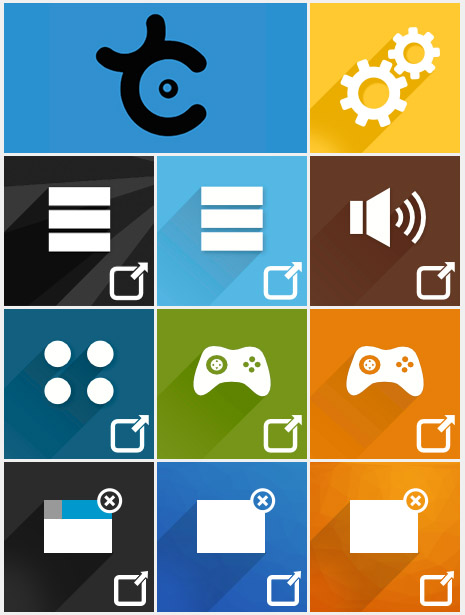
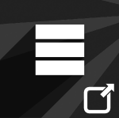

# Interface Xia

À quoi correspondent tous les boutons de l'interface Xia ?

## Paramètres

Ce bouton vous permet de paramétrer 2 choses :
 - **La qualité de votre export** : elle est à 4 par défaut. Si vous comptez mettre l'image XIA en ligne, n'hésitez pas à passer à 1 ou 2 pour qu'elle soit moins lourde.  
 

 - **L'export unique ou non** : Par défaut l'export se fait vers un **fichier unique**. Vous obtenez donc un fichier .html qui va chercher toutes les informations dont il a besoin sur un serveur de la Dane. Il vous faut donc internet pour lire l'image.   
 Vous pouvez décider d'exporter toutes les informations sur votre ordinateur. Vous obtiendrez donc un fichier .html + des dossiers : css, js, fonts, datas. Le fichier html va alors chercher les informations dans ces dossiers qui sont sur votre ordinateur. Vous pouvez lire l'image sans internet.  
   

## Exports Accordéons

### Accordéon Black

   
Exemple : [Napoléon](http://xia.dane.ac-versailles.fr/demo/napoleon/index.html)  
Pour : les images en portrait avec beaucoup de description. Les détails sont zoomables.    
L'image Xia est divisée comme suit :
 - 50% image
 - 50% texte en accordéon

### Accordéon Blue

  
Pour : les images en portrait avec peu de description. Les détails sont zoomables.  
L'image Xia est divisée comme suit :
 - 80% image
 - 20% texte en accordéon

## Export AudioBrown

  
Pour : intégrer uniquement des bandes son. Les popup qui s'ouvrent quand on clique sur un détail sont toutes petites pour supporter uniquement un player.

## Export ButtonBlue

  
Exemple : [Exercice de courbes](http://xia.dane.ac-versailles.fr/demo/courbes/index.html)
Pour : une lecture d'image par étape. Des bouttons avec le numéro de chaque détail s'affichent en haut de l'image.
Astuce : Cet export peut être très utile pour faire des présentations.

## Exports Mini Jeu

Xia permet de faire des mini-jeux.  
=> [Comment réaliser un jeu de clic](oneclick.md)  
=> [Comment réaliser un jeu simple de glisser-déposer](draganddrop_atelier1.md)

### Le jeu de clic

  
Exemple : [Trouve le bon matériel](http://xia.dane.ac-versailles.fr/demo/materiel/index.html)  
Pour : réaliser un jeu où le joueur doit trouver des éléments dans une image en cliquant dessus.

### Le jeu Glisser-Déposer

    
Exemple : [Jeu du Dino](http://xia.dane.ac-versailles.fr/demo/dino/index.html)  
Pour : réaliser un jeu où le jouer doit glisser et déposer un ou des élément(s) sur une cible pour gagner.

## Exports popup

  
Ces 3 exports font apparaître des fenêtres avec la description du détail.   
Les détails sont **zoomables** sur **Material et PopYellow.**   
Sur **PopYellow**, la zone de description apparaît au dessus de l'image, faisant ainsi **glisser celle-ci vers le bas**.   
Astuce : ces 3 exports sont très utiles pour faire des présentations et remplacer des diaporamas.
