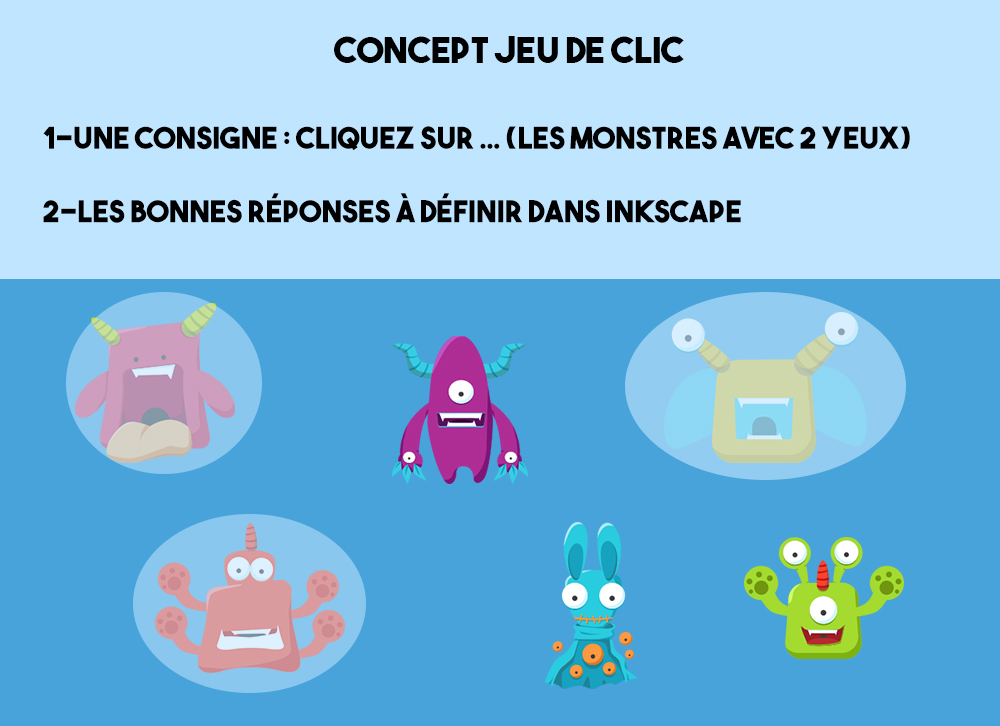

# Réaliser un mini jeu simple de Clic

*Concept* : définir les éléments sur lesquels il faut cliquer. Indiquer un score à obtenir et un message de succès.

Exemples :
- [Jeu de Kiki la Grenouille](https://xia.dane.ac-versailles.fr/demo/kiki/index.html)
- [Jeu des oeufs de Pâques](http://fun_raiders.gitlab.io/paques/)

## C'est parti !

Pour réaliser cet atelier, veuillez télécharger le dossier suivant : [Monstres Clic](https://github.com/pfautrero/xia/raw/XIA_20/doc/monstresclic.zip)

### Préparation des images

En amont de la création du jeu, il faut travailler les visuels.   
- Quelle va-t-être l'image de fond ? Est-ce qu'il y aura un fond uni ou un paysage ?
- Quelles vont-être les images sur lesquelles il faudra cliquer ? Ces images devront être intégrées à l'image de fond. 

Pour cet atelier, nous avons choisi un fond uni et nous y avons ajouté 6 monstres (3 d'entre eux seront clicables). 

Une fois que vous possédez tout le matériel nécessaire pour créer le jeu, vous pouvez vous attaquer à sa création.

### Étape 1 - Charger les images

Ouvrez **Inkscape**.  
  
Chargez l'image de fond : **Fichier -> Ouvrir -> monstresclic.jpg**  
Validez l'importation de l'image.   

### Étape 2 - Définir les bonnes réponses

Dessiner des ellipses à l'endroit des bonnes réponses (Il y a 3 monstres avec 2 yeux). Faites l'ellipse plus ou moins grande en fonction de la précision souhaitée du clic.  

### Étape 3 - Paramétrer le jeu

Le paramétrage du jeu se fait sur l'image de fond.   
**Clic droit sur l'image de fond -> Propriété de l'objet -> champ Description.**   
Après chaque modification du champ Description, pensez à cliquer sur le bouton **Définir**.

Définir le score : **&lt;score&gt;"nombre de bonnes réponses attendues"&lt;/score&gt;** Exemple ici: **&lt;score&gt;3&lt;/score&gt;**  
Définir le message de réussite : **&lt;message&gt;Super tu as réussi !&lt;/message&gt;**  

### Étape 4 - Écrire la consigne

**Fichier -> Propriétés du document -> Métadonnées.**   
Remplissez les champs que vous souhaitez notamment le titre.
Remplir le champ **description** avec la consigne. Elle apparaîtra à l'ouverture de l'image Xia.  
Exemple ici : "Clique sur les monstres qui ont 2 yeux. Attention il y a un piège."  

### Étape 6 - Exporter le jeu

**Extension -> Exporter -> XiaEdu**
Choisir l'export OneClick.  
  
Vous pouvez ensuite tester votre image en allant ouvrir le fichier .html généré. 
