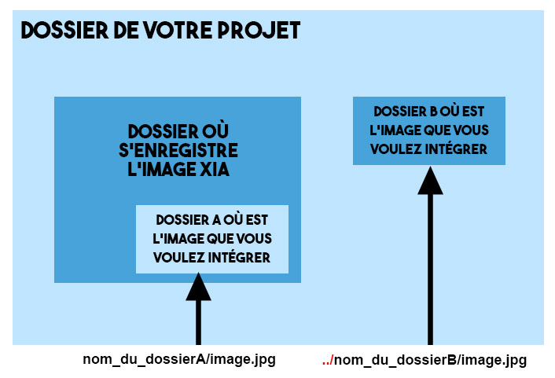
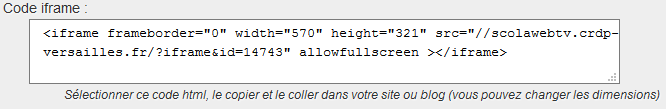

# Comment rédiger dans le champ Description

Le système de rédaction interprété par Xia s'appelle le **pikipiki**. Il permet de mettre en forme du texte sans éditeur, juste à l'aide de touches du clavier.

Quels sont donc les codes les plus utilisés ?

Tout ce qui suit vaut pour les champs Description et Titre.

## Sommaire

[Écrire en gras](#Écrire-en-gras-)  
[Écrire en italique](#Écrire-en-italique-)  
[Liste à puces](#faire-des-listes-à-puces-)  
[Séparer du texte par une ligne](#séparer-du-texte-par-une-ligne-)  
[Ajouter une image](#ajouter-une-image-)  
[Ajouter une vidéo](#ajouter-une-video-)  
[Ajouter du son](#ajouter-du-son-)

## Mise en page
___

### Écrire en gras

**Il faut encadrer son texte de \*\*\***

Exemple : \*\*\* Xia, c'est super \*\*\*  
Rendu : **Xia, c'est super**

### Écrire en italique

**Il faut encadrer son texte de \*\***

Exemple : \*\* Quel outil formidable ! \*\*  
Rendu : *Quel outil formidable !*

### Faire des listes à puces

**Il faut taper : un espace + \* pour le premier niveau**  
Puis : un espace + un espace + \* pour le deuxième niveau.

### Séparer du texte par une ligne

**Il faut écrire \-\-\- entre 2 lignes.**

## Intégration d'images, de vidéos, de son
___

### Ajouter une image

*À partir du Web* : http://xia.dane.ac-versailles.fr/img/xia.png

Un lien simple vers l'image suffit. Vérifiez bien que votre url se termine bien par .jpg, .png, .gif etc...
Vous pouvez récupérer ce lien directement sur une image du web en réalisant un clic droit sur l'image puis **copier l'adresse de l'image**.  
Résultat : elle s'affichera comme une image dans la partie Description après export.

*À partir d'un dossier local* :

### Ajouter une vidéo

*À partir du web* : il faut trouver l'**iframe** de la vidéo que vous désirez intégrer. L'iframe se trouve souvent en cliquant sur un onglet **Partager** sous la vidéo, puis **Intégrer**.

Copier puis coller cette iframe dans le champ Description.

*À partir d'un dossier local* : C'est le même principe que pour les images.  
videosA/ma_video.mp4 ou ../videosB/ma_video.mp4

**Attention** : Afin que votre vidéo puisse être lue par tous les navigateurs, vous devez proposer 3 formats de vidéos dans votre dossier vidéo.
 - Format **mp4**
 - Format **OGG**
 - Format **Webm**   

Cette conversion peut être réalisée à partir du logiciel **VLC**.

### Ajouter du son

Le principe est exactement le même que pour les vidéos. La seule différence réside dans les formats de son à proposer :
 - Format **mp3**
 - Format **OGG**
 - Format **wav**
