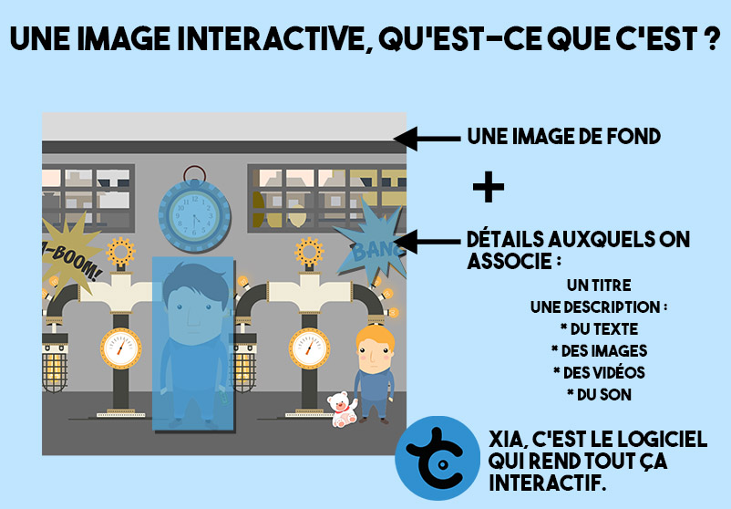
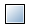
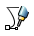
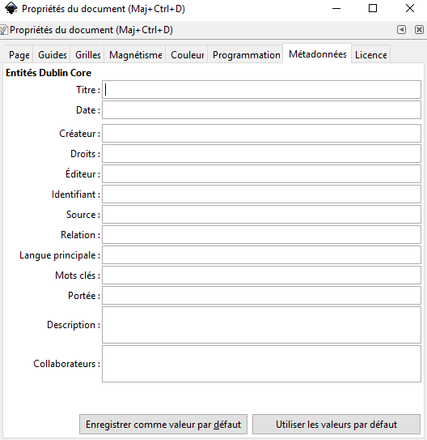

# Réaliser une image interactive simple

## Schéma d'une image interactive

## À vous de jouer !

Pour cet atelier, veuillez télécharger le dossier : [Usine](docs/usine.zip)  

### Ouvrir Inkscape.

### Sélectionner votre image de fond

Fichier -> Ouvrir -> Aller chercher votre image dans le bon dossier puis ouvrez et validez.

### Dessiner les détails

Tout est à disposition dans la barre d'outil à gauche.

Pour des rectangles :

Pour des ellipses :

Pour des détourages plus précis, la courbe de Bézier :

Pour revenir à l'outil Sélection :

**Astuce** : Afin de pouvoir retravailler vos formes, les sélectionner facilement, pensez à les remplir avec une couleur : **Clic droit sur la forme -> Remplissage et contour**

### Associer des informations à vos détails

**Clic droit sur la forme -> Propriété de l'objet**

Remplir les champs **Titre** et **Description**.

=> [Comment écrire dans le champ Description.](pikipiki.md)

Pensez à ***définir*** après chaque modification !!!!!

**Idée**: Vous pouvez également remplir le titre et la description de l'image de fond. Il s'agit en général d'informations contextuelles sur l'image ou de consignes. Elles seront accessibles grâce à une petite bulle pour les thèmes Material et Pop, et en premier onglet pour les thèmes Accordéons.

### Peaufiner votre image

En allant dans **Fichier -> Propriétés du document -> Onglet Métadonnées"**

Remplissez les champs de votre choix.
Il n'y a pas de bouton pour enregistrer. **Fermer simplement la fenêtre.**

### Exporter l'image Xia

Cliquez dans la barre de menu en haut sur **Extension -> Exporter -> XiaEdu**

=> [Les différentes fonctions de l'interface Xia](interface_xia.md)

Choisissez votre format d'export en cliquant dessus, enregistrez dans le dossier de votre choix.

Votre image interactive est disponible dans votre dossier sous la forme d'un **fichier HTML**.
Si vous avez choisi l'export unique, il vous faudra internet pour la visionner. Sinon, elle est directement accessible.
