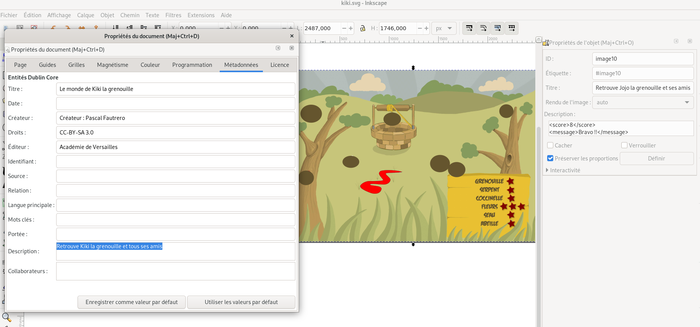
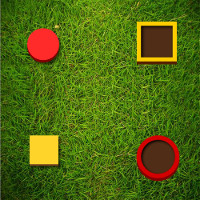
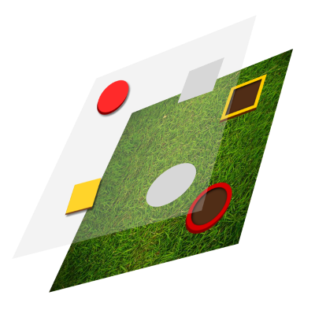
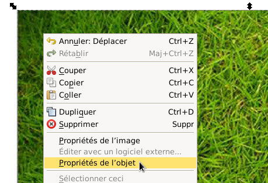
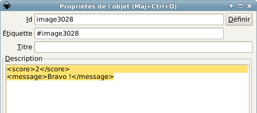
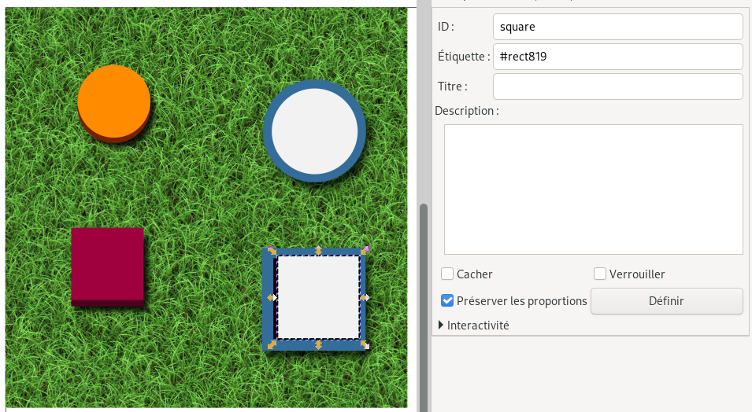

# Xia
### Créer des mini jeux au format HTML5

## Sommaire

- [4. Créer des jeux avec Xia](#creer-des-jeux)
 - [4.1. Premier principe ludique: sélectionner, trouver des éléments dans une image](#game-one-clic)
 - [4.2. Second principe ludique: classer, organiser, hiérarchiser](#game-drag-and-drop)
 - [4.3. Options et astuces](#jeux-options-et-astuces)
  - [4.3.1. Astuce : Montrer la progression dans le jeu (thème game1clic)](#jeux-astuce-progression)
  - [4.3.2. Option : Montrer les erreurs du joueur (thème game1clic)](#jeux-options-score2)
  - [4.3.3. Option : Comment ajouter un effet «aimant» (thème gameDragAndDrop)](#jeux-options-magnet)
  - [4.3.4. Option : Infobulles (thèmes game1clic et gameDragAndDrop)](#jeux-options-infobulles)
  - [4.3.5. Gestion des feedbacks](#gestion-feedbacks)
  - [4.4. En résumé](#jeux-resume)
- [5. Foire aux questions](#faq)
- [6. Astuces Inkscape](#astuces)

<a name='creer-des-jeux'></a>
## 4. Créer des jeux avec Xia

<a name='game-one-clic'></a>
### 4.1. Premier principe ludique : sélectionner, trouver des éléments dans une image

Le principe ludique décrit dans cette partie de la documentation est le suivant: le joueur doit sélectionner des détails dans une image, quand il a sélectionné les éléments indiqués dans la consigne, un message de fin apparaît.

Visualisez le [jeu](https://xia.funraiders.org/exemples/kiki.html) créé pour cette partie de la documentation.

Téléchargez le fichier source au format [svg](https://xia.funraiders.org/exemples/kiki.svg)


Ce type de jeu est presque le type d'image interactive la plus facile à créer. Vous devez uniquement détourer les détails que le joueur devra sélectionner.

Les consignes doivent être indiquées dans les métadonnées du document. Xia cherchera les informations relatives aux consignes dans le champ `Description` des métadonnées du document, et créera une pop up affichant ces consignes à l'ouverture du jeu. Le joueur pourra les lire, fermer la fenêtre puis jouer.

Quand un joueur termine le jeu, un message apparaît automatiquement.

Pour réaliser un jeu de type `game1Clic`, il suffit donc de renseigner dans le champ `Description` de l'image de fond les 2 éléments suivants :
-
Ce message doit être renseigné dans le champ `Description` des `Propriétés de l'objet` de l'image de fond.





>Le texte inséré dans la balise `<message></message>` peut être enrichi avec des images, des vidéos, du son. On peut aussi imaginer ajouter un lien vers un autre jeu, ce qui permettrait aux utilisateurs d'enchaîner les jeux par degré de difficulté.


Une fois votre fichier svg préparé, choisir le modèle d'export `game1clic` pour générer le jeu.

<a name='game-drag-and-drop'></a>
### 4.2. Second principe ludique: classer, organiser, hiérarchiser

#### 4.2.1 Créez votre premier jeu de glisser/déposer

Le second type de jeu pouvant être créé avec Xia est basé sur le principe du glisser-déposer. Des étiquettes déplaçables sont déposées sur l'image de fond. Quand tous les éléments ont été placés sur leur zone de dépôt, un message apparaît, annonçant la fin du jeu comme vous le montre l'exemple suivant :


<a href='https://xia.funraiders.org/exemples/draganddrop.html'></a>

Si vous souhaitez voir le fichier source, Téléchargez le au format [svg](https://xia.funraiders.org/exemples/draganddrop.svg).


Voyons maintenant ensemble comment créer ce mini-jeu.

Comme vous le montre l'illustration suivante, le jeu est composé de 5 éléments :
- 1 image de fond
- 1 image 'carré jaune'
- 1 image 'disque rouge'
- 1 rectangle gris pour matérialiser la cible du carré jaune
- 1 disque gris pour matérialiser la cible du disque rouge



A tout ceci s'ajoutent les `meta-données` suivantes :
- Le message final pour féliciter le joueur en cas de succès (quand le rond est sur le rond et le carré est sur le carré !)
- Les consignes du jeu qui apparaissent au lancement
- Les marqueurs pour préciser que le rectangle gris et le disque gris sont respectivement les zones cibles de notre carré jaune et notre disque rouge.


##### Préparation du jeu

Suivez la petite procédure pas à pas suivante :

- Commencez par télécharger et décompresser le pack d'images nécessaires pour créer ce jeu : [PACK D'IMAGES](https://xia.funraiders.org/demo/simplegame_images.zip)
- Ouvrez l'image `background.jpg` avec Inkscape (`Fichier > Ouvrir`)
- Importez les images `circle.png` et `square.png` (`Fichier > Importer`)
- Tracez un rectangle (notre fameux rectangle gris) au dessus de la zone de réception rectangulaire dessinée sur l'image de fond
- Tracez un disque (notre fameux disque gris) au dessus de la zone de réception circulaire dessinée sur l'image de fond

 Vous avez presque fini ! Il ne reste plus que les meta-données à saisir pour faire fonctionner ce jeu.

##### Renseignement des meta-données

- Commençons par le **message de succès** : Faites un clic droit sur l'image de fond, choisissez `> propriétés de l'objet`



et dans son champ `description`, saisir ceci :

```
<score>2</score>
<message>Bravo !</message>
```




Ceci signifie que lorsque 2 éléments sont bien placés, le message `Bravo !` doit être affiché.

- Continuons avec la **consigne** : Allez dans `Fichier > Meta-données du document` et dans le champ `description`, écrivez votre consigne :

```
Résoudre cette enigme !
```

##### Liaison entre les cibles et les éléments déplaçables

Si nous générons le jeu à ce stade précis de la conception, le cerle rouge et le carré jaune sont bien déplaçables mais ils ne sont pas associés à leurs cibles respectives.

Précisons donc que le rectangle gris est la cible de notre carré jaune. Faites un clic droit sur le rectangle gris, choisissez `propriétés de l'objet` et modifiez son champ id en inscrivant pas exemple `square`. N'oubliez pas de cliquer sur **Définir** pour enregistrer votre modification.




Faites alors un clic droit sur le carré jaune (qui est rouge sur la capture ci-dessus, sic), choisissez `propriétés de l'objet` et saisissez ce qui suit dans le champ description :

```
<target>square</target>
```

Désormais, notre carré est bien configuré pour marquer un point s'il est déposé sur la cible `square`.


Faire la même chose pour le cercle et sa cible.

##### Générer le jeu

Vous pouvez alors réaliser votre export en choisissant `gameDragAndDrop`.

#### 4.2.2 Utilisez les collisions

Le principe ludique documenté dans cette section est le suivant: le joueur doit déplacer des éléments vers des zones de dépôt, mais les déplacements de ces éléments ne peuvent avoir lieu que dans certaines limites. Le jeu de type «`collisions`» peut ainsi être utilisé pour créer des labyrinthes, des taquins.

Visualisez le [jeu](https://xia.funraiders.org/exemples/lapin.html) créée pour cette partie de la documentation.

Téléchargez le fichier source au format [svg](https://xia.funraiders.org/exemples/lapin.svg).

Pour créer ce type de jeu, ajoutez la balise `<collisions>on</collisions>` à l'image de fond. Une fois cela fait, tous les détails deviennent «`solides`», et bloquent le déplacement des objets qu'il faut déplacer (images au format png importées, ou copie bitmap de formes dessinées avec Inkscape).

Le jeu de type «collisions» est en réalité un jeu de type gameDragAndDrop, puisque la résolution passe par le dépôt d'un ou plusieurs éléments à certains endroits de l'image. Les balises nécessaires dans ce type de jeu sont donc les mêmes que dans le jeu gameDragAndDrop `<target></target>` sur les objets, `<score></score>` et `<message></message>` sur l'image de fond.

Une fois votre fichier svg préparé, choisir le modèle `gameDragAndDrop` pour générer le jeu.

<a name='jeux-options-et-astuces'></a>
### 4.3. Options et astuces

<a name='jeux-astuce-progression'></a>
#### 4.3.1. Astuce : Montrer la progression dans le jeu (thème game1clic)

Il est possible de faire s'afficher des éléments graphiques quand le joueur
sélectionne une réponse correcte. Ces éléments peuvent être des png importés
ou des formes directement dessinées dans Inkscape. Comme Xia considère
qu'une forme dessinée avec les outils d'Inkscape est un détail, il faudra
transformer ces formes en utilisant l'outil «~copie bitmap~». Par exemple:
\begin{enumerate}
 \item Dessinez une étoile aux bords jaunes et au fond jaune avec les outils de
dessin d'Inkscape
 \item Sélectionnez cette étoile, et cliquez sur \softmenu{Édition $\rightarrow$
Créer une copie bitmap}
 \item Supprimer l'étoile créée avec les outils de dessin
\end{enumerate}

Une fois les éléments importés (format png) ou créés (copie bitmap des
formes dessinées manuellement), appliquez-leurs les caractéristiques
suivantes:
\begin{center}
\softmenu{Interactivité > OnClick} = \verb|off|
\end{center}
Ensuite, groupez le détail cliquable et son élément graphique (en cliquant
successivement sur le détail et l'élément en maintenant la touche \Shift
enfoncée), puis en sélectionnant \softmenu{Grouper} dans le menu
\softmenu{Objet} d'Inkscape.

<a name='jeux-options-score2'></a>
#### 4.3.2. Option : Montrer les erreurs du joueur (thème game1clic)

On voit clairement l'intérêt pédagogique des jeux basés sur le principe de
la sélection\ldots mais on voit également rapidement comment des élèves
peuvent être tentés de contourner le dispositif ludique pour terminer les
jeux sans avoir à réfléchir (par exemple, en cliquant frénétiquement partout
sur l'image, jusqu'à trouver par hasard tous les détails répondant à la
consigne).

C'est la raison pour laquelle il peut être intéressant de mettre en valeur
les erreurs commises par le joueur.

Pour cela, il faudra prévoir les erreurs pouvant être commises, et placer
sur l'image des éléments graphiques symbolisant l'erreur (croix rouge,
etc.). Ces éléments pouvant être des images au format png importées ou des
formes dessinées dans Inkscape, puis copiées en bitmap (voir la rubrique
\ref{playersscore}). Ces éléments devront posséder les caractéristiques
suivantes:
\begin{center}
\softmenu{Interactivité > OnClick} = \verb|disable-score|
\end{center}
Une fois la balise \verb|disable-score| appliquée, le détail demeure
cliquable, mais sa sélection n'ajoutera pas un point au compteur surveillant
le score pour délivrer le message de fin.

<a name='jeux-options-magnet'></a>
#### 4.3.3. Option : Comment ajouter un effet «aimant» (thème gameDragAndDrop)

Si vous indiquez \verb|<magnet>on</magnet>| dans le champ
\softmenu{Description} de la zone de dépôt, un effet aimant sera activé
quand le joueur déposera l'élément sur celle-ci.

\subsubsection{Liens sur les zones de dépôt (thème gameDragAndDrop)}

Vous pouvez insérer un lien dans le champ \softmenu{Titre} des
\softmenu{Propriétés de l'objet} de la zone de dépôt. L'utilisateur peut
cliquer sur cette zone ou y déposer l'étiquette correspondante pour suivre
le lien.

<a name='jeux-options-infobulles'></a>
#### 4.3.4. Option : Infobulles (thèmes game1clic et gameDragAndDrop)


\begin{links}
Visualisez l'\href{http://xia.dane.ac-versailles.fr/demo/tuto/xia7}{image
interactive} créée pour cette partie de la documentation.

Téléchargez le fichier source au format
\href{http://xia.dane.ac-versailles.fr/demo/tuto/xia7/svg/xia7.svg}{svg}.
\end{links}

Il est possible de faire s'afficher des infobulles lorsque la souris survole
certains détails. Pour cela, créez l'infobulle avec une image au format png
importée ou une copie bitmap (voir rubrique \ref{playersscore}) d'un texte
créé dans Inkscape\footnote{Ou une copie bitmap d'une forme groupée avec du
texte\ldots}, et appliquez à cette infobulle une \softmenu{ID} spéicifique
dans les \softmenu{Propriétés de l'objet}. Ensuite, indiquez la balise
\verb|<tooltip>ID_de_l_infobulle</tooltip>| dans le champ
\softmenu{Description} des \softmenu{Propriétés de l'objet} du détail censé
déclencher l'apparition de l'infobulle (par exemple, dans l'image
ci-dessous: au survol de la souris, le carré jaune fait apparaître
l'infobulle "Test"):\\


\begin{center}
 \includegraphics[width=0.5\textwidth]{images/tooltip_example}\\
 \end{center}

Notez que cette fonctionnalité est également disponible avec les thèmes
game1clic et gameDragAndDrop.\\


\subsubsection{Double compteur de score (thèmes game1clic et gameDragAndDrop)}

En indiquant \verb|score2| dans le champ \softmenu{onclick}
(\softmenu{Propriétés de l'objet $\rightarrow$ Interactivité}) du détail, et
en utilisant les balises\\
\texttt{<score2></score2>} et \texttt{<message2></message2>} dans les
\softmenu{Propriétés de l'objet} de l'image de fond, on peut créer un
système de double comptage des points, dans lequel l'utilisateur peut
sélectionner deux types de détails différents.

Ainsi, vous pouvez créer un jeu où 3 détails comportent la balise
\texttt{score2} (cette balise correspondant à des erreurs), et indiquez dans
les \softmenu{Propriétés de l'objet} de l'image de fond:\\
\texttt{<score>4</score>\\ <message>Bravo!</message>\\ <score2>3</score2>\\
<message2>3 erreurs... Ça fait beaucoup...\\
Concentrez-vous et recommencez!...</message2>}\\

<a name='gestion-feedbacks'></a>
#### 4.3.5. Gestion des feedbacks.

- onfail return
- score2 pour gestion des erreurs
-

<a name='jeux-resume'></a>
### 4.4. En résumé

Ces tableaux résument les balises pouvant être utilisées dans le cadre de la création de jeux avec Xia:

#### 4.4.1 Balises Game1clic

|Balise|Rôle|Élément|Où ?|
|---|---|---|---|
|`<score></score>`|Permet de régler le nombre de bonnes réponses nécessaires pour faire apparaître le message de fin du jeu|Image de fond|`Propriétés de l'objet` &rarr; `Description`|
|`<message></message>`|Fait apparaître le message de fin du jeu, que vous pouvez enrichir avec des ressources multimédias ou un lien hypertexte|Image de fond|`Propriétés de l'objet` &rarr; `Description`|
|`off`|Rend un détail insensible au clic|Détail|`Propriétés de l'objet` &rarr; `Interactivité` &rarr; `Onclick`|
|`disable-score`|Rend un détail détouré cliquable, mais sa sélection n'ajoutera pas de point au compteur de score|Détail|`Propriétés de l'objet` &rarr; `Interactivité` &rarr; `Onclick`|
|`score2`|Si on clique sur ce détail, ajoute un point au deuxième compteur de score|Détail|`Propriétés de l'objet` &rarr; `Interactivité` &rarr; `Onclick`|
|`<tooltip></tooltip>`|Affiche une infobulle au survol de la souris. Assurez-vous que ce champ est identique à l'ID de l'élément servant d'infobulle|Détail|`Propriétés de l'objet` &rarr; `Description`|
|`<score2></score2>`| Régler le nombre de bonnes réponses nécessaires à l'apparition du second message (jeu à double score)|Image de fond|`Propriétés de l'objet` &rarr; `Description`|
|`<message2></message2>`|Contient le message de fin de jeu si le second score est atteint (jeu à double score). Message que vous pouvez enrichir avec des ressources multimédias ou un lien hypertexte|Image de fond|`Propriétés de l'objet` &rarr; `Description`|

#### 4.4.2 Balises GameDragAndDrop

|Balise|Rôle|Élément|Où ?|
|---|---|---|---|
|`<score></score>`|Permet de régler le nombre de bonnes réponses nécessaires pour faire apparaître le message de fin du jeu|Image de fond|`Propriétés de l'objet` &rarr; `Description`|
|`<message></message>`|Fait apparaître le message de fin du jeu, que vous pouvez enrichir avec des ressources multimédias ou un lien hypertexte|Image de fond|`Propriétés de l'objet` &rarr; `Description`|
|`<target></target>`|Indique la correspondance entre l'élément à déplacer et la zone de dépôt. Assurez-vous que ce champ est identique à l'ID de la zone de dépôt|Détail déplaçable|`Propriétés de l'objet` &rarr; `Description`|
|`<magnet>on</magnet>`|Ajoute un effet «aimant»|Zone de dépôt|`Propriétés de l'objet` &rarr; `Description`|
|`<collisions>on</collisions>`|Active le jeu de type "collisions". Les détails ne peuvent plus se chevaucher, idéal pour un jeu de type labyrinthe|Image de fond|`Propriétés de l'objet` &rarr; `Description`|


  \multicolumn{3}{|l|}{\texttt{<collisions>on</collisions>}}\\
  \hline
  & \emph{Rôle} & Active le jeu de type "collisions" \\
  & \emph{Élément} & Image de fond \\
  & \emph{Où?} & \softmenu{Propriétés de l'objet $\rightarrow$ Description} \\
  \hline
  \multicolumn{3}{|l|}{\texttt{<collisions>off</collisions>}}\\
  \hline
  & \emph{Rôle} & Crée une zone de dépôt dans un jeu de type "collisions"\\
  & \emph{Élément} & Zone de dépôt\\
  & \emph{Où?} & \softmenu{Propriétés de l'objet $\rightarrow$ Description} \\
  \hline
    \multicolumn{3}{|l|}{\texttt{<tooltip></tooltip>}}\\
  \hline
  & \emph{Rôle} & Affiche une infobulle au survol de la souris \\
  & \emph{Élément} & Zone de dépôt, éléments à déplacer \\
  & \emph{Quoi?} & Assurez-vous que ce champ est identique à l'ID de l'élément servant
d'infobulle\\
  & \emph{Où?} & \softmenu{Propriétés de l'objet $\rightarrow$ Description}\\
  \hline
 \multicolumn{3}{|l|}{\texttt{<score2></score2>}}\\
 \hline
 & \emph{Rôle} & Régler le nombre de bonnes réponses nécessaires à l'apparition du second
message (jeu à double score)\\
 & \emph{Élément}  & Image de fond \\
 & \emph{Où?} & \softmenu{Propriétés de l'objet $\rightarrow$ Description} \\
 & \emph{Quoi?} & Le nombre de bonnes réponses nécessaires à la résolution du jeu\\
 \hline
 \multicolumn{3}{|l|}{\texttt{<message2></message2>}}\\
 \hline
  & \emph{Rôle} & Fait apparaître le second message de fin du jeu (jeu à double score) \\
  & \emph{Élément}  & Image de fond \\
  & \emph{Où?} & \softmenu{Propriétés de l'objet $\rightarrow$ Description}\\
  & \emph{Quoi?} & Message que vous pouvez enrichir avec des ressources multimédias ou un lien
hypertexte\\
  \hline
  \end{tabular}
  \caption{Balises à insérer en vue d'un export gameDragAndDrop}
\end{table}

\section{Foire aux questions et trucs et astuces pour le logiciel Inkscape}
