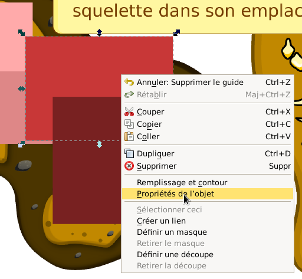

# Créer des images interactives

## Sommaire

- [1. Présentation de Xia](#presentation)
    - [1.1. Qu'est-ce que Xia ?](#quest-ce-que-xia)
    - [1.2. Processus général ?](#processus-general)
    - [1.3. Installer Inkscape et Xia ?](#installer-inkscape-et-xia)
- [2. Création d'une première image interactive avec Inkscape et Xia](#creation-dune-premiere-image-interactive)
    - [2.1. Création de la ressource support](#creation-ressource-support)
    - [2.2. Génération de l'image interactive avec Xia](#generation-image-interactive)
    - [2.3. Usage d'expert !](#export-ligne-de-commande)
- [3. Images interactives enrichies](#images-interactives-enrichies)
    - [3.1. Mise en forme du texte (moteur wiki)](#mise-en-forme-du-texte)
    - [3.2. Insérer des ressources multimédias dans les commentaires](#inserer-ressources-multimedia)
        - [3.2.1. Utiliser une ressource locale](#ressource-multimedia-locale)
        - [3.2.2. Utiliser une intégration iframe](#ressource-multimedia-iframe)
        - [3.2.3. Utiliser une intégration oembed](#ressource-multimedia-oembed)
        - [3.2.4. Astuce : Créer une musique d'ambiance ou un descriptif sonore](#ressource-multimedia-ambiance)
    - [3.3. Insérer des images dans votre image interactive](#inserer-des-images)
        - [3.3.1. Image de fond composite](#image-de-fond-composite)
        - [3.3.2. Image sélectionnable](#image-selectionnable)
    - [3.4. Faire apparaître une question/un indice et dévoiler une réponse](#question-reponse)
    - [3.5. Contrôler le comportement des détails: affichage immédiat et désactivation](#comportement-details)
    - [3.6. Contrôler l'ordre d'affichage des détails dans la barre latérale des commentaires](#ordre-details)
    - [3.7. En résumé](#resume-images-enrichies)
- [4. Foire aux questions](#faq)
- [5. Astuces Inkscape](#astuces)

## 1. Présentation de Xia <a name="presentation"></a>

### 1.1. Qu'est-ce que Xia? <a name="quest-ce-que-xia"></a>

Xia est un logiciel libre développé par des enseignants de l'académie de Versailles. Il est distribué sous la licence [GPLv3](http://www.gnu.org/copyleft/gpl.html). Le logiciel xia a pour fonction de transformer un fichier svg en une animation interactive html5. Xia permet de générer des jeux et activités interactives: jeux de glisser-déposer, sélection, discrimination, etc.

Les premières parties de cette documentation (voir la partie [II](#creation-dune-premiere-image-interactive)) sont consacrées à la réalisation d'une image interactive simple: détails détourés et commentaires en texte sans mise en forme. Par la suite, vous apprendrez à créer des images interactives enrichies (voir la partie [III](#images-interactives-enrichies)).


Tous les exemples utilisés sont visibles en ligne (les liens pour visualiser les animations et télécharger les fichiers sources sont indiqués en début de chaque section). À la fin de chaque partie, une rubrique **«En résumé»** rappelle les points essentiels à retenir pour créer une image interactive.


### 1.2. Processus général <a name="processus-general"></a>

Xia n'est nécessaire qu'à la fin du processus. Comme on peut le voir sur l'illustration ci-dessous, la plus grande partie du travail est réalisée avec un logiciel de dessin vectoriel. Nous recommandons l'utilisation du logiciel libre et multi-plateforme [Inkscape](http://www.inkscape.org/), très simple à utiliser (c'est ce logiciel qui sera utilisé dans ce tutoriel).


Si vous possédez des projets créés avec le logiciel ImagesActives (fichiers possédant une extension .xia), vous pouvez changer l'extension de ces fichiers en .zip, les dézipper, récupérer le fichier svg se trouvant dans le répertoire ainsi obtenu et ouvrir celui-ci avec Inkscape. Si vous utilisez GNU/Linux, explorez le fichier «.xia» et récupérez le fichier «.svg».


### 1.3. Installer Inkscape et Xia <a name="installer-inkscape-et-xia"></a>

L'installation d'Inkscape et de Xia sont les seuls prérequis pour la poursuite de la lecture de cette documentation. Vous trouverez les informations nécessaires à l'installation d'Inkscape sur le site web du projet https://inkscape.org/fr/telecharger/.

Installez impérativement Inkscape en premier, puis Xia, sous peine de ne pas être en mesure d'accéder à Xia directement dans Inkscape.

## 2. Création d'une première image interactive avec Inkscape et Xia <a name='creation-dune-premiere-image-interactive'></a>

### 2.1. Création de la ressource support <a name='creation-ressource-support'></a>


Visualisez l' [image interactive](https://xia.dane.ac-versailles.fr/demo/tuto/xia1) créée pour cette partie de la documentation. Téléchargez le fichier source au format
[svg](https://xia.dane.ac-versailles.fr/demo/tuto/xia1/xia1.svg).


Les manipulations décrites dans cette partie de la documentation vous permettront de créer une image interactive «basique», comprenant:
- des détails zoomables
- des commentaires uniquement constitués de texte non mis en forme

Une fois l'image choisie, ouvrez-la dans Inkscape -> Fichier -> Ouvrir  

Quand Inkscape vous demande de choisir **Lier** et **Incorporer l'image**, choisissez **Incorporer**.

Les informations renseignées dans les **Métadonnées du document** (menu **Fichier**) seront conservées dans l'animation générée : titre, créateur, droits, etc. Il est donc fortement conseillé de renseigner ces informations. Le rendu est visible sur l'image ci-dessous :


Le titre renseigné dans les métadonnées du document apparait au-dessus de l'image interactive et donne son nom à la page web l'affichant. Le créateur et les droits associés apparaissent dans la pop up accessible via l'icône «**i**» située à droite du titre de l'image interactive.

Vous pouvez sauvegarder votre projet au format svg dès le début du travail, en allant dans le menu -> Fichier -> Enregistrer.

Vous pouvez, par souci de clarté, supprimer l'extension d'origine de votre image dans le champ **Nom** de la fenêtre de dialogue. Enfin, dans le menu déroulant, choisissez le format de fichier Inkscape svg:

**SVG Inkscape (*.svg)**

De nombreux outils d'Inkscape peuvent être utilisés pour détourer les détails qui deviendront actifs dans l'animation générée par Xia. Parmi ceux-ci:
-  Créer des rectangles et des carrés
-  Créer des cercles, des ellipses et des arcs
-  Dessiner des lignes à main levée
-  Tracer des courbes de Bézier et des segments de droite

Sans rentrer dans le détail du fonctionnement de ces différents outils (Pour cela, lire le [manuel d'inkscape](http://inkscape.org/doc/shapes/tutorial-shapes.fr.html) ou le [manuel Floss](http://en.flossmanuals.net/inkscape/)), sachez que l'outil **Tracer des courbes de Bézier et des segments de droite** permet de détourer "clic par clic" (les points de construction du polygone sont alors appelés des «**nœuds**»). Vous pouvez refermer votre polygone en cliquant sur le premier nœud de ce même polygone. Vous pouvez dessiner des **Courbes de Bézier** en gardant le clic de votre souris enfoncé après avoir créé un nœud, puis en déplaçant le curseur pour faire apparaître les poignées de contrôle afin de modifier la forme de la courbe.


Si vous laissez une forme ouverte dans Inkscape (une courbe par exemple), Xia refermera automatiquement celle-ci en joignant son point de départ et d'arrivée.


L'ordre de création des détails dans Inkscape sera respecté dans l'image interactive au format html5 (par exemple, le premier détail détouré dans Inkscape apparaîtra en haut dans le modèle accordéon ou en numéro 1 dans le modèle boutons).

Une fois les détails détourés (La couleur du contour des détails dans l'animation générée par Xia sera la même que celle choisie dans Inkscape), vous pouvez les sélectionner avec l'outil **Sélectionner et transformer des objets** afin de les redimensionner, les déplacer, etc.


Si vous avez des difficultés pour sélectionner un détail que vous avez détouré, appliquez-lui une couleur de fond. N'importe quelle couleur fera l'affaire, sauf noir et blanc (pour comprendre pourquoi, lisez la rubrique \ref{white_black_background}).


Vous pouvez accéder aux **Propriétés de l'objet** par un clic-droit sur le détail détouré. À partir de là, vous accédez à une fenêtre de dialogue vous permettant d'ajouter le texte qui sera associé au détail dans l'image interactive:



Les deux champs devant nécessairement être renseignés dans cette fenêtre sont les champs **Titre** et **Description**. Le titre deviendra celui du détail, la description son commentaire. N'oubliez pas de cliquer sur le bouton **Définir** avant de fermer la fenêtre des **Propriétés de l'objet**.

Le processus décrit ci-dessus doit également être effectué avec l'image de fond: le titre et la description de celle-ci serviront d'introduction générale à l'image interactive (il s'agit d'un titre et d'un commentaire qui ne sont pas reliés à un détail particulier).

### 2.2. Génération de l'image interactive avec Xia <a name='generation-image-interactive'></a>

Quand tous les détails sont détourés et leurs métadonnées renseignées, Xia peut être lancé en cliquant sur `> Extensions > Exporter > Xia édu`.


Choisissez un modèle d'export et un répertoire d'enregistrement de l'image interactive.

En cliquant sur l'une des icônes des modèles d'export, vous générez un fichier `html`. Double-cliquez dessus pour l'ouvrir dans votre navigateur pour voir votre image interactive au format html5.


La ressource ainsi générée nécessite un accès internet pour fonctionner pleinement.


### 2.3. Usage d'expert ! <a name='export-ligne-de-commande'></a>

Vous pouvez générer vos animations html5 en utilisant le `terminal` avec la commande **xia**. Les paramètres à utiliser sont **--input** pour indiquer le fichier en entrée, **--output** pour indiquer le répertoire d'export, **--theme** pour indiquer le thème choisi.


**Avec GNU/Linux**, pour un export fichier unique utilisant le thème accordionBlack :
```
xia --input monfichier.svg --output ~/export --theme accordionBlack --export singlefile --quality 3
```

**Avec Mac OS X**, pour un export utilisable sans connexion internet, utilisant le thème gameDragAndDrop :

```
cd /Applications/xia.app/Contents/Resources/
python xia.py --input monfichier.svg --output ~/export --theme gameDragAndDrop --export local
```

**Avec Windows**, pour un export fichier unique utilisant le thème accordionBlack, il faut utiliser l'outil XIA version portable (téléchargeable sur le site de XIA). Une fois l'archive zip décompressée,(supposons que vous l'ayez fait dans xia-windows), il faut éditer le fichier `xia-windows/xia/xia.bat` comme suit :


Puis double-cliquer sur le fichier `xia.bat` pour lancer l'export.


<a name='enriched_ia'></a>

## 3. Images interactives enrichies <a name='images-interactives-enrichies'></a>


Visualisez l'[image interactive](https://xia.dane.ac-versailles.fr/demo/tuto/xia2) créée pour cette partie de la documentation. Téléchargez le fichier source au format [svg](https://xia.dane.ac-versailles.fr/demo/tuto/xia2/xia2.svg).

Dans cette section, l'objectif demeure la création d'une image interactive «**simple**» (autrement dit, dans laquelle un détail fait apparaître un commentaire). Cependant, le texte des commentaires sera enrichi par une mise en forme ou des ressources multimédias.


### 3.1. Mise en forme du texte (moteur Wiki) <a name='mise-en-forme-du-texte'></a>

Pour enrichir le texte et proposer des ressources multimédia, XIA s'appuie sur une syntaxe wiki élémentaire. Comme vous pouvez le constater en comparant les deux captures ci-dessous, il suffit d'ajouter des **marqueurs** spécifiques dans le texte pour réaliser la mise en forme ou simplement écrire les liens vers les ressources à intégrer.


Texte saisi avec les marqueurs wiki :


Rendu final :


#### Syntaxe Wiki et intégration de ressources.

- `***Mettre en gras***`
- `**Mettre en italique**`
- `# titre de niveau 1`, `## titre de niveau 2` ... (c'est la syntaxe ***markdown*** des titres, on peut aller jusqu'à 6 niveaux)
- `{{{écrire du texte sans formatage}}}`
- Pour insérer une image qui se trouve sur internet, écrivez simplement le lien vers cette image :
```
https://xia.dane.ac-versailles.fr/img/xia.png
```
- Pour insérer une image qui se trouve à côté de la ressource XIA que vous avez générée, utilisez la syntaxe des chemins relatifs (le `.` signifie `à côté de` et le `..` signifie `remonter dans le dossier parent`) :
```
./mon_image.jpeg
images/mon_autre_image.jpeg
../images/mon_image.png
```

- Pour créer un hyperlien vers le site XIA, saisissez simplement l'url :
```
https://xia.dane.ac-versailles.fr
```
- Pour créer un hyperlien sur un mot ou une expression :
```
[https://xia.dane.ac-versailles.fr SITE XIA]
```
- Pour créer un hyperlien sur une adresse mail, saisissez simplement l'adresse mail :
```
dev-xia@ac-versailles.fr
```

- Utiliser une liste à puces (***Placer un espace devant chaque astérisque***) :
```
 * élément 1
 * élément 2
   * élément 2-1
   * élément 2-2
```

### 3.2. Insérer des ressources multimédias dans les commentaires <a name='inserer-ressources-multimedia'></a>

#### 3.2.1. Utiliser une ressource locale <a name='ressource-multimedia-locale'></a>

L'insertion de ressources multimédias dans les commentaires est chose assez aisée: copiez-collez l'url de la ressource (qu'elle soit absolue ou relative) ou le code iframe du service web utilisé pour héberger votre ressource, et Xia créera automatiquement un lecteur multimédia, pour peu que celle-ci (image, son, vidéo) fasse partie des formats supportés :

- **[Images]** : jpg, jpeg, png, gif
- **[Audio]** : ogg, mp3
- **[Video]** : ogv, webm, mp4

Le lien doit être inséré dans le champ `Description` des `Propriétés de l'objet`.

- **[Lien absolu]** : Si l'url de la ressource est `http://web.crdp.ac-versailles.fr/02546.ogg`, il suffit alors d'écrire cette url dans le champ `Description` des
`Propriétés de l'objet` dans Inkscape.

- **[Lien relatif]** : Si le fichier de la ressource multimédia se trouve dans le répertoire d'export de l'image interactive, ou dans un répertoire contenu dans celui-ci, indiquez simplement le chemin vers le fichier, en considérant le répertoire d'export comme répertoire racine. Par exemple, si le fichier `video.ogv` se trouve dans le répertoire `videos` se trouvant lui-même dans le répertoire de l'image interactive, indiquez :

```
./videos/video.ogv
```

pour créer le lecteur multimédia.


Les formats vidéos gérés par Xia ne le sont pas par tous les navigateurs web. Il est donc recommandé d'exporter les vidéos dans les 3 formats supportés (mp4, ogv et webm), et de les téléverser dans le même répertoire. Ainsi, même si un format spécifique est renseigné dans la description (si l'on suit l'exemple précédent: `videos/video.ogv`), si le navigateur est incapable de lire
la ressource, il cherchera automatiquement à lire les fichiers du même nom mais possédant une extension différente (c'est à dire, `video.mp4`  et `video.webm`).

#### 3.2.2. Utiliser une intégration iframe <a name='ressource-multimedia-iframe'></a>

Une autre possibilité consiste à insérer un code `iframe`. Celui-ci sera interprété et le lecteur du service web apparaîtra, donnant accès à la ressource.


#### 3.2.3. Utiliser une intégration oembed <a name='ressource-multimedia-oembed'></a>

Une dernière possibilité, la plus simple de toutes, vous permet d'insérer des ressources en utilisant la technologie `oembed`. Actuellement, XIA sait gérer les services externes suivants :

- **Flickr** : Utilisez directement leur système de partage comme par exemple `https://flic.kr/p/jZ2A12`
- **Scolawebtv** (service de l'académie de Versailles) : Utilisez directement leurs liens oembed comme par exemple `https://scolawebtv.crdp-versailles.fr/?id=3740`
- **WebTv** (service de l'académie de Versailles) : Utilisez directement leurs liens oembed comme par exemple `http://webtv.ac-versailles.fr/spip.php?article1205`

#### 3.2.4. Astuce : Créer une musique d'ambiance ou un descriptif sonore<a name='ressource-multimedia-ambiance'></a>

XIA est capable de lancer des bandes sonores à la demande. Imaginons que vous vouliez ajouter une bande sonore qui explique la ressource proposée au lancement de cette dernière. Pour l'exemple, supposons que vous ayez enregistré votre commentaire dans le fichier `commentaire.mp3`. Il vous suffit alors d'écrire la ligne suivante dans la ** description de l'image de fond** :

```
./commentaire.mp3 autostart
```
Le `.` signifie que le fichier est local (situé juste à côté de votre ressource xia) et le `autostart` signifie que XIA doit lancer la ressource immédiatement sans action spécifique de l'utilisateur.


### 3.3. Insérer des images dans votre image interactive <a name='inserer-des-images'></a>

#### 3.3.1. Image de fond composite <a name='image-de-fond-composite'></a>

Après avoir réalisé votre image interactive, vous vous rendez compte qu'il manque des éléments dans votre image de fond. Sachez que vous pouvez a posteriori ajouter d'autres images et ainsi les grouper avec l'image de fond pour constituer une image de fond composite. Pour faire cela :

- Sélectionnez `> Fichier > Importer` dans Inkscape afin d'incorporer votre nouvelle image.
- Sélectionnez votre image de fond et votre nouvelle image en même temps (Utilisez la touche `Shift` au moment de la sélection multiple)
- Groupez ces deux éléments sélectionnés en allant dans le menu `> Objets > Grouper`


#### 3.3.2. Image sélectionnable <a name='image-selectionnable'></a>

Il arrive que vous ayez besoin d'ajouter des commentaires sur votre image qui ne soient pas liés à un détail. Une méthode simple consiste à ajouter une image à votre composition. Par défaut, cette image ne sera visible qu'au survol. Si vous souhaitez la rendre persistante, il suffit d'avoir recours à un artifice : appliquez une couleur de fond blanche sur cette image.
L'image importée n'apparaîtra dans l'animation html5 qu'à une condition: que vous lui ayez appliqué un fond blanc dans Inkscape. Choisissez la couleur blanche dans la palette horizontale en bas de l'interface d'Inkscape:


En indiquant une url dans le champ `Titre` des `Propriétés de l'objet`, cette image incorporée deviendra un lien cliquable.


### 3.4. Faire apparaître une question/un indice et dévoiler une réponse <a name='question-reponse'></a>

Vous pouvez créer une icône cliquable, qui empêche temporairement un utilisateur de lire la suite du commentaire. Vous pouvez même demander à l'utilisateur d'indiquer un mot de passe pour lire la suite du commentaire.

Pour cela, utilisez la syntaxe suivante :

```
TITRE : Quel est le prénom du seigneur Vador ?
```


```
DESCRIPTION :

[[Indice : Pensez à un pigment Sombre !]]

[[Voir la réponse : Dark]]
```

Voici le résultat obtenu sur un thème `accordionBlack` :


Si vous cliquez sur les boutons, voici le résultat :


Pour rendre les choses plus difficiles, vous pouvez aussi utiliser un code pour verrouiller les boutons comme suit. Supposons que vous vouliez interdire l'accès à l'indice avec le code `security` :


```
TITRE : Quel est le prénom du seigneur Vador ?
```


```
DESCRIPTION :

[[Indice (code=security): Pensez à un pigment Sombre !]]

[[Donner la réponse (code=Dark): Bravo !]]
```
Dès que l'élève cliquera sur le bouton `Indice`, un champ de saisie apparaitra pour lui permettre de saisir le code de sécurité. De même, quand il cliquera sur le bouton `Donner la réponse`, il devra saisir le mot `Dark` pour laisser apparaître le message de succès. Notez que ce dernier usage est un contournement de la fonctionnalité initiale.


Les éléments `[[..]]` peuvent être imbriqués.


### 3.5. Contrôler le comportement des détails: affichage immédiat et désactivation <a name='comportement-details'></a>

Par défaut, le comportement des détails d'une image interactive est le suivant :
- mise en valeur des détails au survol de la souris ou par un clic sur son titre dans les commentaires,
- effet de zoom lors d'un second clic sur le détail actif.

Ces deux comportements par défaut peuvent être modifiés si vous appliquez un fond noir ou blanc aux détails détourés :

- **[Détail avec un fond blanc]** Dans l'image interactive, ces détails seront visibles immédiatement, sous la forme d'un aplat de couleur opaque, cachant l'image de fond; une fois sélectionné, ce fond sera visible (le zoom demeure actif).
- **[Détail avec un fond noir]** Les utilisateurs devront cliquer pour activer le détail, mais l'effet de zoom est désactivé.

Conséquence logique: comme un détail ne saurait avoir simultanément un fond noir et un fond blanc, un détail ne peut donc être à la fois immédiatement visible et avoir le zoom désactivé.

### 3.6. Contrôler l'ordre d'affichage des détails dans la barre latérale des commentaires <a name='ordre-details'></a>

Par défaut dans une image interactive de type `accordéon`, les détails apparaissent verticalement en suivant l'ordre dans lequel ils ont été créés dans Inkscape (le premier détail créé dans Inkscape correspond à celui placé en haut dans la barre latérale de l'image interactive).

Pour changer cet ordre par défaut, utilisez les boutons dédiés de la barre de menu :


Commencez par sélectionner le détail sur lequel vous voulez agir et cliquez sur l'un des 4 boutons ci-dessus pour modifier la `profondeur` du détail.

### 3.7. En résumé <a name='resume-images-enrichies'></a>

- Vous pouvez enrichir et mettre en forme le texte en utilisant des balises
- L'enrichissement multimédia est possible par simple lien (relatif ou absolu) vers un fichier dont le format est reconnu par Xia
- On ajoute des images sur l'image de fond en les incorporant et en leur appliquant un fond blanc.
- On peut modifier le comportement par défaut des détails en leur appliquant une couleur de fond (blanc ou noir)
- L'ordre des détails de l'image interactive dépend de l'ordre de leur création dans Inkscape. Cependant, on peut utiliser l'éditeur XML d'Inkscape pour modifier cet ordre
- Il est possible d'empêcher les utilisateurs d'accéder au commentaire en insérant une icône cliquable et / ou un mot de passe

## 4. Foire aux questions <a name='faq'></a>

### Je ne vois pas Xia dans le menu extensions d'Inkscape. Pourquoi?

Avez-vous installé Inkscape avant Xia? Si ce n'est pas le cas, ré-installez Xia. Si vous utilisez la version portable de Xia, le fait que rien n'apparaisse dans le menu extension est tout à fait normal.

### L'icône «Fichier source» n'apparaît pas quand je lance Xia depuis le menu extension d'Inkscape. Pourquoi?

En lançant Xia depuis les extensions d'Inkscape, il n'y a pas d'icône «~Fichier source~», puisque Xia considère que l'animation html5 que vous souhaitez générer est celle sur laquelle vous travaillez dans Inkscape... Choisissez donc uniquement les options d'exportation et le modèle.

### J'ai installé Inkscape mais je ne le retrouve pas dans mes programmes. Où se cache-t-il?
Xia se trouve dans le dossier des «~Applications~» de Mac OS X.  Sur un sytème GNU/Linux, le paquet Xia porte le nom «~xia-converter~».  Sur Windows, Xia ne fonctionne que comme extension d'Inkscape. Si vous souhaitez utiliser le logiciel seul, utilisez la version portable.

### J'ai ajouté du texte sur mon image avec l'outil «~Créer et éditer des objets textes~», mais je ne le vois pas apparaître dans mon image interactive. Pourquoi?

Si vous ne faites pas de copie bitmap du texte, Xia considèrera que le texte créé avec l'outil «~Créer et éditer des objets textes~» est un détail, et pas une image à afficher.

## 5. Astuces Inkscape <a name='astuces'></a>

- Ajoutez des couleurs de fond à vos détails. Les détails seront ainsi plus faciles à sélectionner et modifier, et cela n'aura aucune conséquence sur l'animation html5 (sauf si vous choisissez le blanc ou le noir comme couleur de remplissage).
- Si vous voulez créer un détail à partir de plusieurs, vous pouvez les **«Grouper»**.
- Quand un détail est créé, il est toujours possible de le modifier: ajout ou suppression de nœuds, déplacement, etc. Il suffit de double-cliquer sur un détail et d'utiliser les outils de modification
- Si vous créez votre image interactive uniquement avec les outils de dessin d'Inkscape (en faisant des copies bitmap de formes ou d'images importés), nous vous recommandons fortement de grouper tous les objets (y compris l'image de fond), de faire une copie bitmap de cet ensemble, et d'utiliser cette copie bitmap comme image de fond. Si vous ne le faites pas, certaines images ou copies bitmap risque de disparaître dans l'image interactive lorsque des détails situés au-dessus d'eux seront sélectionnés (ce qui est
logique: le rôle principal d'un détail est de permettre à l'utilisateur de voir ce qui se trouve sur l'image de fond).
